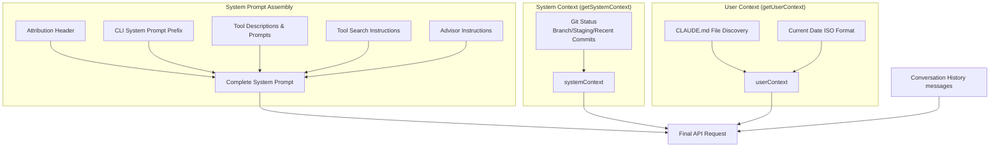
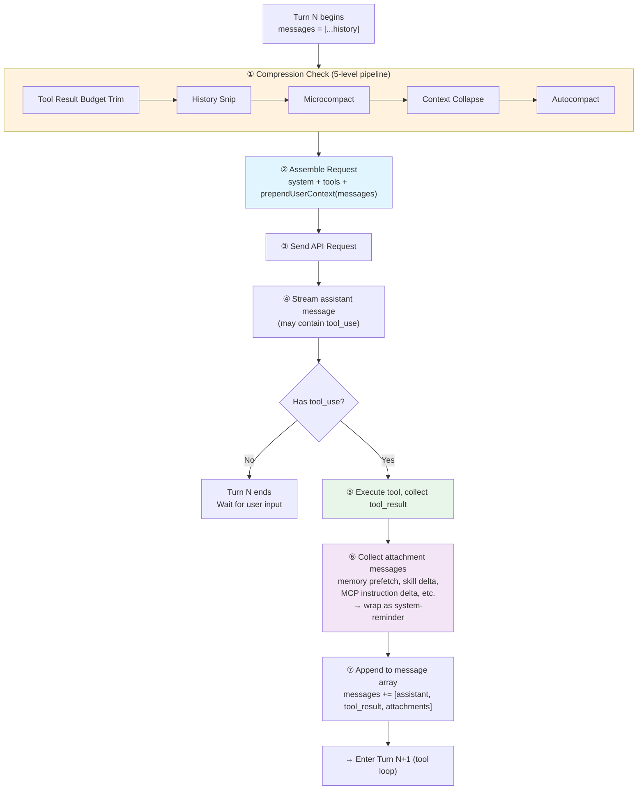
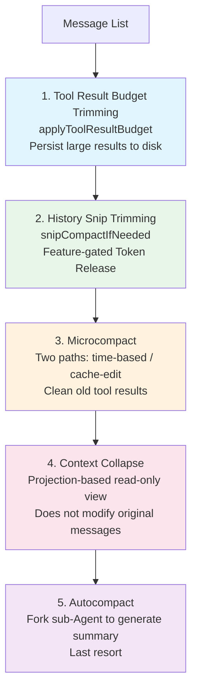
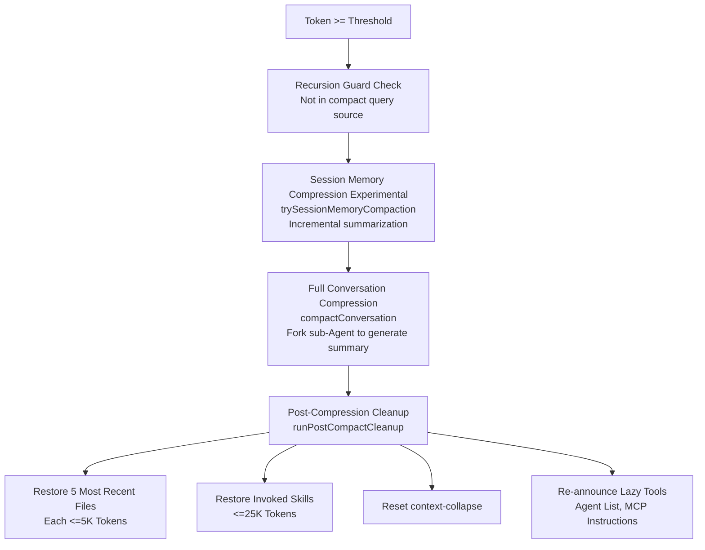

# Chapter 3: Context Engineering

> Context engineering is the invisible pillar of Claude Code's capabilities. The quality of the model's decisions depends entirely on what context it sees.

## Why Is Context Engineering So Important?

LLMs have a fixed-size context window (Claude's current maximum is 200K tokens). Yet a real coding session may involve dozens of file reads, hundreds of tool calls, and easily produce over a million tokens of raw text — far exceeding the context window's capacity.

This means the system must make difficult trade-offs: **which information stays in the context, and which gets compressed or discarded**. If these trade-offs are poorly made, the model will forget which file it just edited, repeatedly read content it has already seen, or produce output that contradicts its previous decisions.

Think of the context window as a desk: the desktop space is limited, and you must keep the most important documents at hand while filing the rest into drawers. Context engineering is this "document management system" — deciding what goes on the desk (context construction), when to file old documents into drawers (compression), and how to quickly retrieve filed documents when needed (persistence and recovery).

But context engineering faces an additional challenge beyond fitting information into the window. Each API request's system prompt and tool definitions alone may total **50-100K tokens**. To avoid reprocessing all of that from scratch every time, Claude Code relies on server-side **prefix caching** (KV Cache) — the server remembers previously processed prefixes, so subsequent requests only need to process the new additions, dramatically reducing latency and cost.

Prefix caching, however, comes with a brutal constraint: **the prefix must be byte-for-byte identical to hit the cache**. Not "close enough" — any single byte of change — even just toggling a request header or reordering a tool — invalidates the entire prefix cache, forcing all 50-100K tokens to be reprocessed.

This gives context engineering a feeling of **"dancing in chains"**: you can't freely reorder prompt sections, can't casually add or remove tool definitions, can't change request metadata mid-session... every design decision must simultaneously satisfy two goals — **give the model the best possible context** while **not breaking the cache**. Throughout this chapter, you'll see this tension repeatedly: many mechanisms that seem "over-engineered" are actually driven by cache stability concerns.

The amount of engineering Claude Code puts into this area far exceeds most people's expectations. This chapter will deeply analyze its complete context management system.

Key files: `src/context.ts` (190 lines), `src/utils/api.ts`, `src/services/compact/`

## 3.1 Context Construction Overview

Every time the Claude API is called, the model starts from zero — it has no persistent memory across requests and can only see the content carried in the current request. Therefore, Claude Code must assemble all the information the model needs into a complete request before every API call.

This assembly process involves three pillars:

1. **System Prompt**: Defines the model's identity, capability boundaries, and behavioral rules. This is the most stable part, essentially unchanged across requests.
2. **System & User Context**: Environmental information (git status, platform) and project knowledge (CLAUDE.md instruction files). Computed once per session.
3. **Message History**: User questions, model responses, tool calls and results — recording everything that happened in the conversation. This is the fastest-changing and most space-consuming part.



### Anatomy of a Complete API Request

The three pillars above are somewhat abstract. Let's look at what an actual API request looks like. The Claude API request body has three top-level fields: `system` (system prompt array), `tools` (tool schema array), and `messages` (message array). Here's their complete structure:

```
┌─────────────────────────────────────────────────────────────┐
│  system — System Prompt Array (multiple TextBlocks)          │
│  ┌────────────────────────────────────────────────────────┐  │
│  │ [0] Attribution Header                     not cached  │  │
│  │ [1] CLI Prefix (interactive / -p mode)     not cached  │  │
│  │ ─── Static Content ──────────────────── 🔒 global ──  │  │
│  │ [2] Core instructions + tool descriptions + safety     │  │
│  │     rules + behavioral guidelines                      │  │
│  │     (identical for ALL users)                          │  │
│  │ ─── __SYSTEM_PROMPT_DYNAMIC_BOUNDARY__ ────────────── │  │
│  │ ─── Dynamic Content ──────────────────── not cached ── │  │
│  │ [3] Output style, language prefs, MCP instructions     │  │
│  │     (varies by user/session)                           │  │
│  └────────────────────────────────────────────────────────┘  │
│                                                               │
│  tools — Tool Schema Array                                    │
│  ┌────────────────────────────────────────────────────────┐  │
│  │ Built-in tools (Read, Edit, Bash, Grep, Write, Glob…) │  │
│  │ MCP tools (user-installed, may have defer_loading)     │  │
│  │ Last tool ← marked with cache_control as breakpoint   │  │
│  │ ── After breakpoint ──                                 │  │
│  │ Server-side tools (advisor etc., toggle won't bust     │  │
│  │ cache)                                                 │  │
│  └────────────────────────────────────────────────────────┘  │
│                                                               │
│  messages — Message Array                                     │
│  ┌────────────────────────────────────────────────────────┐  │
│  │ [User]  <system-reminder>                               │  │
│  │           CLAUDE.md content + current date               │  │
│  │           (computed once at session start)               │  │
│  │         </system-reminder>                   (isMeta)   │  │
│  │                                                          │  │
│  │ [User]  User's 1st message                               │  │
│  │ [Asst]  Model response (may contain tool_use blocks)    │  │
│  │ [User]  tool_result                                      │  │
│  │ [User]  Attachment messages (each a separate isMeta      │  │
│  │         user message):                                   │  │
│  │          ├ <system-reminder> memory files </…>           │  │
│  │          ├ <system-reminder> available skills </…>       │  │
│  │          ├ <system-reminder> deferred tool results </…>  │  │
│  │          └ <system-reminder> MCP instruction delta </…>  │  │
│  │ [Asst]  Model's 2nd response                             │  │
│  │ …(messages keep growing until compression kicks in)      │  │
│  └────────────────────────────────────────────────────────┘  │
└─────────────────────────────────────────────────────────────┘
```

A few key design decisions to note:

- **Memory, skills, and MCP instructions** are NOT in the system prompt — they're injected as `<system-reminder>` attachment messages in the message array. This way they can be injected incrementally and on-demand (only when content changes), without breaking the system prompt cache
- **CLAUDE.md and date** are "meta information" but placed in the first message (not the system prompt), because CLAUDE.md content varies by project — putting it in the system prompt would reduce cache sharing
- The **tool schema array** has `cache_control` marked on the last tool, and the server caches everything up to that point. Optional tools like advisor are placed after the breakpoint so toggling them won't affect the cache

The following table summarizes how each component behaves within a session:

| Component | Location in Request | Change Frequency (in session) | Notes |
|-----------|-------------------|-------------------------------|-------|
| Core system instructions | `system` (before boundary) | **Never** — identical for all users | Globally cached, shared worldwide |
| Dynamic system instructions | `system` (after boundary) | **Never** — varies by user but fixed within session | Determined at session start |
| Tool schemas | `tools[]` | **Rarely** — only on MCP reconnect or Tool Search | Deferred loading reduces churn |
| CLAUDE.md + date | `messages[0]` | **Never** — memoized once at session start | Wrapped in system-reminder |
| User messages + model replies | `messages` | **Every turn** — grows with each interaction | Compression controls growth |
| Tool calls / results | `messages` | **Every tool execution** | Old results cleaned by Microcompact |
| Memory files | `messages` (attachments) | **On demand** — injected when relevant, deduplicated | Max 60KB per session |
| Skills / MCP instructions | `messages` (attachments) | **Incremental** — only delta injected when list changes | No redundant resending |

### How One Turn Changes the Context

Now that we understand the static structure, let's see the dynamic process — what happens to the context during a single turn (Turn N):



**Key takeaway**: The context is "alive" — with each turn, the message array grows (new assistant reply + tool_result + attachments), while compression mechanisms check and control the growth rate at the start of each turn. The system prompt and tool list remain essentially unchanged throughout the session, which is precisely why they can be efficiently cached.

## 3.2 System Prompt Construction

The system prompt is the most stable part of the context — it defines "who" the model is and "what it should do". Precisely because it's stable, it's also the best candidate for prompt caching. Claude Code's system prompt construction strikes a careful balance between stability and flexibility.

### Attribution Header
A fingerprint-based identity marker used to track request origins.

### CLI System Prompt Prefix
Varies by execution mode: interactive mode (REPL) and `-p` single-query mode have different prefix instructions.

### System Prompt Priority

The system prompt construction has strict priority ordering, implemented by `buildEffectiveSystemPrompt()` (`src/utils/systemPrompt.ts`):

```typescript
// Priority from highest to lowest:
// 0. overrideSystemPrompt — Complete override (e.g., loop mode)
// 1. coordinatorSystemPrompt — Coordinator mode (Feature-gated)
// 2. agentSystemPrompt — Agent-defined prompt
//    - Proactive mode: Appended after the default prompt
//    - Normal mode: Replaces the default prompt
// 3. customSystemPrompt — Specified via --system-prompt parameter
// 4. defaultSystemPrompt — Standard Claude Code prompt
// + appendSystemPrompt is always appended to the end (except in override mode)
```

This priority chain ensures that different execution modes (interactive, Agent, coordinator, SDK) all receive the correct system prompt while preserving user customization capabilities.

### Static/Dynamic Boundary Marker

There is a key design element in the system prompt — `SYSTEM_PROMPT_DYNAMIC_BOUNDARY` (`src/constants/prompts.ts:114`). This is a sentinel string `__SYSTEM_PROMPT_DYNAMIC_BOUNDARY__` that divides the system prompt array into two halves:

- **Before the boundary**: Core instructions, tool descriptions, safety rules, etc. — content that is **completely identical across all sessions for all users**
- **After the boundary**: MCP tool instructions, output style, language preferences, etc. — content that varies by user/session

Why is this boundary needed? Because it directly affects the efficiency of prompt caching. The static part before the boundary can be cached with `scope: 'global'`, **shared across all users** — this means millions of Claude Code users worldwide can share the same cached core system prompt. The dynamic part after the boundary can only use `scope: 'org'` or no caching. Without this boundary, the entire system prompt would only get org-level caching, wasting large amounts of cache storage on completely identical content.

### Section-Level Caching

The various components of the system prompt implement section-level caching through `systemPromptSections.ts`. There are two types:

```typescript
// Computed once, cached until /clear or /compact
systemPromptSection('toolInstructions', () => buildToolPrompt(...))

// Recomputed every turn, will break prompt cache
DANGEROUS_uncachedSystemPromptSection(
  'modelOverride',
  () => getModelOverrideConfig(),
  'Live feature flags may change mid-session'  // Must provide a reason
)
```

The `DANGEROUS_` prefix is intentional code-level warning — it reminds developers: **this section is recomputed every turn, and if the value changes it will break the prompt cache**. Developers must provide a `_reason` parameter explaining why cache breaking is necessary. Most sections are stable (tool descriptions, safety rules), and only a few sections that depend on real-time feature flags need to use the `DANGEROUS_` variant.

`clearSystemPromptSections()` is called during `/clear` and `/compact`, simultaneously resetting the beta header latch (see 3.6 Layer 2), giving the next conversation a completely fresh state.

### System Context (`getSystemContext`)

The `getSystemContext()` function from `src/context.ts` is **memoize-cached** (computed only once per session).

The complete implementation shows a carefully designed context collection process:

```typescript
// src/context.ts — getGitStatus()
export const getGitStatus = memoize(async (): Promise<string | null> => {
  const isGit = await getIsGit()
  if (!isGit) return null

  try {
    // 5 git commands executed in parallel
    const [branch, mainBranch, status, log, userName] = await Promise.all([
      getBranch(),
      getDefaultBranch(),
      execFileNoThrow(gitExe(), ['--no-optional-locks', 'status', '--short'], ...)
        .then(({ stdout }) => stdout.trim()),
      execFileNoThrow(gitExe(), ['--no-optional-locks', 'log', '--oneline', '-n', '5'], ...)
        .then(({ stdout }) => stdout.trim()),
      execFileNoThrow(gitExe(), ['config', 'user.name'], ...)
        .then(({ stdout }) => stdout.trim()),
    ])

    // Status truncated to 2000 characters, preventing many uncommitted files from blowing up the context
    const truncatedStatus = status.length > MAX_STATUS_CHARS
      ? status.substring(0, MAX_STATUS_CHARS) +
        '\n... (truncated because it exceeds 2k characters...)'
      : status

    return [
      // This disclaimer is crucial — it tells the model that git status is a snapshot from session start,
      // preventing the model from "hallucinating" real-time git status updates in subsequent turns
      `This is the git status at the start of the conversation. Note that this status is a snapshot in time, and will not update during the conversation.`,
      `Current branch: ${branch}`,
      `Main branch (you will usually use this for PRs): ${mainBranch}`,
      ...(userName ? [`Git user: ${userName}`] : []),
      `Status:\n${truncatedStatus || '(clean)'}`,
      `Recent commits:\n${log}`,
    ].join('\n\n')
  } catch (error) {
    logError(error)
    return null
  }
})
```

Noteworthy design details:
- **`Promise.all` parallelism**: 5 git commands execute simultaneously instead of waiting sequentially — this can save hundreds of milliseconds in large repositories
- **`--no-optional-locks`**: Avoids git commands acquiring locks that could conflict with other git operations
- **`MAX_STATUS_CHARS = 2000`**: Limits status output length. Imagine a monorepo with 500 uncommitted files — without truncation, git status alone would consume a significant context budget
- **Disclaimer text**: Explicitly tells the model this is a snapshot that won't update in real-time — an important measure to prevent model hallucination

`getSystemContext()` itself also has conditional skip logic:

```typescript
export const getSystemContext = memoize(async () => {
  // Skip in CCR (Cloud Code Remote) mode or when git-instructions are disabled
  const gitStatus =
    isEnvTruthy(process.env.CLAUDE_CODE_REMOTE) ||
    !shouldIncludeGitInstructions()
      ? null
      : await getGitStatus()

  // Cache break injection (internal debugging feature, Feature-gated)
  const injection = feature('BREAK_CACHE_COMMAND')
    ? getSystemPromptInjection()
    : null

  return {
    ...(gitStatus && { gitStatus }),
    ...(injection ? { cacheBreaker: `[CACHE_BREAKER: ${injection}]` } : {}),
  }
})
```

### User Context (`getUserContext`)

```typescript
export const getUserContext = memoize(async () => {
  // Subtle semantics of --bare mode:
  // - CLAUDE_CODE_DISABLE_CLAUDE_MDS: Hard disable, always effective
  // - --bare: Skips auto-discovery (CWD traversal), but respects explicit --add-dir
  // Original comment: "bare means skip what I didn't ask for, not ignore what I asked for"
  const shouldDisableClaudeMd =
    isEnvTruthy(process.env.CLAUDE_CODE_DISABLE_CLAUDE_MDS) ||
    (isBareMode() && getAdditionalDirectoriesForClaudeMd().length === 0)

  const claudeMd = shouldDisableClaudeMd
    ? null
    : getClaudeMds(filterInjectedMemoryFiles(await getMemoryFiles()))

  // Cached for yoloClassifier use, avoiding import cycle creation
  setCachedClaudeMdContent(claudeMd || null)

  return {
    ...(claudeMd && { claudeMd }),
    currentDate: `Today's date is ${getLocalISODate()}.`,
  }
})
```

### CLAUDE.md Discovery Mechanism

CLAUDE.md is Claude Code's **project-level instruction file**, similar to `.editorconfig` or `.eslintrc`, but targeting the AI Agent. Its discovery process is more complex than it appears.

**Discovery order** (`getMemoryFiles()`):
1. **Managed policy files**: Instructions read from MDM (Mobile Device Management) policies (e.g., `/etc/claude-code/CLAUDE.md`)
2. **User home directory**: Global configuration under `~/.claude/CLAUDE.md`
3. **Project files**: Traversing the directory tree upward from CWD, looking for instruction files at each level
4. **Local files**: `CLAUDE.local.md` (personal instructions not committed to git)
5. **Explicitly added directories**: Extra directories specified via the `--add-dir` parameter

**Filename patterns**: Each directory is checked for `CLAUDE.md`, `.claude/CLAUDE.md`, and **all `.md` files** under the `.claude/rules/` directory. This means you can split instructions for different domains into independent files (e.g., `.claude/rules/testing.md`, `.claude/rules/style.md`), and the system will automatically load them.

**Priority ordering**: Files are loaded in far-to-near order — **files closer to CWD are loaded later**, thus having higher priority. This follows the "proximity principle": global rules in the project root can be overridden by local rules in subdirectories. Since LLMs pay more attention to content at the end of the context ([recency bias](https://en.wikipedia.org/wiki/Recency_bias)), later-loaded instructions carry more weight in the model's "attention".

**`@include` directive** (`src/utils/claudemd.ts`):

CLAUDE.md files can reference other files using `@` syntax:

```markdown
# Project Instructions
@./docs/coding-standards.md
@~/global-rules.md
@/etc/company-policy.md
```

- `@path` (no prefix) is equivalent to `@./path`, resolved as a relative path
- `@~/path` resolves from the user home directory
- `@/path` resolves as an absolute path
- Only effective in leaf text nodes (`@` inside code blocks will not be parsed)
- Referenced files are inserted as independent entries **before** the referencing file
- Circular references are prevented by tracking processed files
- Only text file extensions are allowed (.md, .txt, etc.), preventing loading of binary files

**Filtering**: `filterInjectedMemoryFiles()` excludes files matching the `.claude-injected-*` pattern — these are programmatically injected by Hooks or the system, not manually written by users

**Cache invalidation**: `clearMemoryFileCaches()` clears the cache when the working directory changes; `resetGetMemoryFilesCache()` completely reloads when the `InstructionsLoaded` Hook fires

### Context Injection Order

```typescript
// src/utils/api.ts
const fullSystemPrompt = asSystemPrompt(
  appendSystemContext(systemPrompt, systemContext)  // System context appended
)
// userContext is prepended before messages (prependUserContext)
```

System context is **appended after** the system prompt, while user context is **prepended before** messages — this order affects the efficiency of prompt caching. The system prompt is the most stable part (unchanged across requests), and placing it at the front favors cache hits; while user context (CLAUDE.md, date) may change with the session, and placing it before messages won't break the system prompt's cache.

## 3.3 Message History Management

Claude Code doesn't simply send all historical messages to the API. It manages the message list through a series of mechanisms, ensuring that messages sent to the API are properly formatted and content is lean.

### Compact Boundary

After autocompact occurs, a `compact_boundary` marker is inserted into the message list. Subsequent API calls only send messages after the boundary:

```typescript
let messagesForQuery = [...getMessagesAfterCompactBoundary(messages)]
```

When the `HISTORY_SNIP` Feature is enabled, it further projects a "trimmed view" on top of this — hiding messages marked as snipped from the API request.

### Message Normalization (`normalizeMessagesForAPI`)

`normalizeMessagesForAPI()` (`src/utils/messages.ts`, approximately 200 lines) is a critical processing step before messages are sent. It solves a core problem: **the internal message format of Claude Code and the message format required by the API are not fully consistent**.

```typescript
// src/utils/messages.ts
export function normalizeMessagesForAPI(
  messages: Message[],
  tools: Tools = [],
): (UserMessage | AssistantMessage)[] {
  const availableToolNames = new Set(tools.map(t => t.name))

  // 1. Attachment reordering + filter virtual messages
  const reorderedMessages = reorderAttachmentsForAPI(messages)
    .filter(m => !((m.type === 'user' || m.type === 'assistant') && m.isVirtual))

  // 2. Build error→block type mapping (PDF too large, image too large, etc.)
  const errorToBlockTypes: Record<string, Set<string>> = { ... }
  const stripTargets = new Map<string, Set<string>>()  // userUUID → block types to strip

  // 3-7. Iterate through messages, processing each one:
  //   - Strip tool_reference, advisor blocks, error media items
  //   - Handle thinking/signature blocks
  //   - Merge split AssistantMessages with same ID
  //   - Validate and repair tool_use/tool_result pairing
  ...
}
```

Below is each processing step and the problem it solves:

**1. Attachment reordering** (`reorderAttachmentsForAPI`): Attachment messages may appear at arbitrary positions internally, but the API requires them to be before the semantically associated message. This step bubbles attachment messages upward until they encounter a `tool_result` or `assistant` message. **Without this step**, the API might see an isolated image block without knowing which message it's associated with.

**2. Filtering virtual messages**: Messages marked as `isVirtual` (such as temporary messages from REPL internal tool calls) are removed. **These messages exist solely for UI display** — for example, automatically triggered internal operations need to show progress in the interface, but they should not enter the API request.

**3. Building error→block type mapping**: Certain API errors (such as "PDF too large", "image too large") require stripping the corresponding media blocks from subsequent messages. The system builds a mapping table `errorToBlockTypes`, mapping error text to block types that need to be stripped (`document`, `image`). **Without this step**, the same oversized PDF would be sent with every request, triggering the same error each time.

**4. Stripping internal elements**: Removes `tool_reference` (tool reference markers), advisor blocks, and media items that need to be stripped due to API errors from messages. `tool_reference` is an internal tracking marker for the lazy tool loading system (Tool Search), and the API has no concept of it — **their presence would cause the API to return format errors**.

**5. thinking/signature block handling**: Handles thinking blocks according to model requirements. Some models don't support `thinking` or `redacted_thinking` blocks — **sending them would directly cause the API to return a 400 error**. Signature blocks are used to verify the integrity of thinking blocks and also need to be stripped on unsupported models.

**6. Merging split messages**: The streaming parser may split a single API response into multiple `AssistantMessage`s with the same `message.id` (when parallel tool calls produce multiple content blocks). **The API expects one response to correspond to one message**, and multiple messages with the same ID would violate the message alternation rule.

**7. Validating and repairing pairs**: The API requires every `tool_use` block to have a corresponding `tool_result`, and vice versa. Session crashes, compression, and mid-session interruptions can all break this pairing relationship. This step detects and repairs orphan blocks — **generating error-type `tool_result`s for `tool_use`s missing results**, and injecting synthetic `tool_use`s for `tool_result`s missing requests. Without this step, recovering a crashed session would almost certainly error out due to incomplete pairing.

**Why so complex?** Because the Claude API has strict requirements for message format: user/assistant messages must alternate, `tool_use`/`tool_result` must be paired, and thinking blocks cannot appear in unsupported positions. Yet Claude Code's internal message list may violate these constraints due to session crash recovery, compression operations, user interruptions, and other reasons. `normalizeMessagesForAPI` is the defense layer — ensuring that no matter how chaotic the internal state, the API always receives a valid message sequence.

## 3.4 Five-Level Compression Pipeline

This is the core mechanism of Claude Code's context management. As conversations grow longer and token usage keeps increasing, the five-level compression pipeline activates level by level. The design philosophy is **progressive compression** — try to free space using the lowest-cost means first, only deploying heavier weapons when necessary.



### Why Execute in This Order?

Each level is "heavier" than the previous one — consuming more computational resources or losing more context detail:

1. **Tool Result Budget first**: Pure local operation, no API calls. Large results written to disk, context only retains a preview. Zero latency, zero cost.
2. **Snip releases the most**: Directly removes redundant parts from the message list, freeing large amounts of tokens, potentially making subsequent compression unnecessary.
3. **Microcompact has extremely low cost**: Cleans old tool results, no API calls, suitable for frequent execution.
4. **Context Collapse before Autocompact**: Context Collapse is a projection-based compression — creating a read-only folded view of messages without modifying original data (see Level 4). Folding may bring token usage below the Autocompact threshold, thus preventing unnecessary full compression — preserving finer-grained context.
5. **Autocompact as the last resort**: Requires forking a sub-Agent to call the API and generate a summary, highest cost, and irreversible (original messages replaced by summary).

### Detailed Explanation of Each Level

#### Level 1: Tool Result Budget Trimming

`applyToolResultBudget()` is the lightest processing — a pure local operation with no API calls. The core problem it solves is: **a single tool call may return enormous results**. For example, using `FileReadTool` to read a ten-thousand-line file, or using `BashTool` to execute a `find` command that returns thousands of file paths.

Processing mechanism (`src/utils/toolResultStorage.ts`):

1. Each tool declares a `maxResultSizeChars`, with default value `DEFAULT_MAX_RESULT_SIZE_CHARS = 50,000` characters
2. Thresholds can be overridden per tool name via GrowthBook Feature Flag (`tengu_satin_quoll`)
3. When tool results exceed the threshold, **instead of simply truncating, they are persisted to disk**

```
Persistence path: {projectDir}/{sessionId}/tool-results/{tool_use_id}.{txt|json}
```

Only a compact reference message is kept in the context:

```xml
<persisted-output>
Output too large (2.3 MB). Full output saved to: /tmp/.claude/session-xxx/tool-results/toolu_abc123.txt

Preview (first 2.0 KB):
[Preview of the first 2000 bytes of content]
...
</persisted-output>
```

**Why choose persistence over truncation?** Truncation means permanent data loss — if the model later needs to see the full output (say, it found a bug on line 500), it cannot recover. Persistence retains the complete data, and the model can use the `Read` tool at any time to read the disk file for the full content. The 2KB preview gives the model enough information to judge whether it needs to see the complete result.

Additionally, `applyToolResultBudget` also tracks replaced tool results (`ContentReplacementState`), ensuring that session recovery (resume) makes exactly the same replacement decisions as the original session, maintaining prompt cache stability.

#### Level 2: History Snip

`snipCompactIfNeeded()` is a Feature-gated function (`HISTORY_SNIP`) that frees tokens by trimming redundant parts from historical messages. The freed amount is passed via `snipTokensFreed` to subsequent autocompact threshold checks — this is important because snip removes messages but the last assistant message's `usage` still reflects the pre-snip context size; without correction, autocompact would trigger prematurely.

#### Level 3: Microcompact

Microcompact is one of the most ingenious mechanisms in Claude Code's compression system. Its goal is to **clean up old tool results that are no longer needed in the history** — if you read a file 30 minutes ago, that tool result is most likely no longer useful, but it might still be occupying thousands of tokens.

Key design: Microcompact has **two completely different paths**, chosen based on cache state:

**Path A: Time-based Microcompact (cache cold)**

When a user leaves for a while and comes back (time since last assistant message exceeds the configured minutes), the server-side prompt cache has already expired (default 5-minute TTL). At this point the cache is "cold", and the full prefix needs to be re-uploaded regardless of what you do.

In this case, Microcompact **directly modifies message content**:

```typescript
// Replace old tool results with placeholders
return { ...block, content: '[Old tool result content cleared]' }
```

Only the results from the most recent N compressible tools are kept (`keepRecent`, keeping at least 1), and all others are replaced with placeholders. Because the cache is already cold, modifying message content doesn't cause additional cache invalidation — the cache needs to be rebuilt anyway.

Compressible tool types: `FileRead`, `Shell/Bash`, `Grep`, `Glob`, `WebSearch`, `WebFetch`, `FileEdit`, `FileWrite`.

**Path B: Cache-edit Microcompact (cache still hot)**

When the cache hasn't expired yet (user has been in active conversation), the situation is completely different. Directly modifying message content would cause the cache key to change, **invalidating 100K+ tokens of cached prefix**, requiring re-upload and re-billing.

Therefore, the cache-edit path **does not modify local messages at all**. It uses an ingenious API-level mechanism:

1. Adds a `cache_reference` field to tool result blocks (equal to `tool_use_id`), allowing the server to locate the specific position in the cache
2. Constructs `cache_edits` blocks telling the server "delete the content pointed to by these `cache_reference`s"
3. The server deletes in-place in the cache, without needing the client to re-upload the prefix

```typescript
// Messages themselves unchanged, editing happens at the API layer
// cache_edits blocks are passed to the API layer via consumePendingCacheEdits()
return { messages } // Returned as-is!
```

Already-sent `cache_edits` are saved via `pinCacheEdits()` and re-sent at their original positions in subsequent requests (the server needs to see them to maintain cache consistency).

| | Time-based MC | Cache-edit MC |
|---|---|---|
| **Trigger condition** | Time interval exceeds threshold (cache cold) | Tool count exceeds threshold (cache hot) |
| **Operation method** | Directly modify message content | `cache_edits` API blocks |
| **Impact on cache** | Cache needs rebuilding anyway, no extra impact | Maintains cache warmth, avoids re-upload |
| **API calls** | Zero | Zero (edits piggybacked on next normal request) |
| **Applicable scenario** | First request after user returns | Continuous cleanup during active conversation |

The two paths are mutually exclusive: time-triggered has higher priority; if time-triggered takes effect, the cache-edit path is skipped (because the cache is cold, using `cache_edits` is pointless).

#### Level 4: Context Collapse

**Projection-based** context folding — the key characteristic is that it **does not modify original messages**. It creates a folded view of messages, replacing unimportant early messages with summaries. This allows folding to persist across turns and be rolled back when needed.

```typescript
// src/query.ts — Context Collapse is a read-time projection, doesn't write to original messages
if (feature('CONTEXT_COLLAPSE') && contextCollapse) {
  const collapseResult = await contextCollapse.applyCollapsesIfNeeded(
    messagesForQuery, toolUseContext, querySource
  )
  messagesForQuery = collapseResult.messages
}
```

This can be analogized to a database View: the underlying table (message array) data remains unchanged, but what you see when querying (sending API requests) is a filtered/transformed view. Summaries are stored in an independent collapse store, and `projectView()` overlays the folded view onto the original messages at each loop entry.

Context Collapse commits folds at approximately **90%** context utilization, while Autocompact's trigger threshold is slightly below this (depending on `reservedTokensForSummary`, approximately 83%~90% of total window, see Level 5 threshold calculation). Running both simultaneously would create competition — the source code comments explicitly state *"Autocompact firing at effective-13k (~93% of effective) sits right between collapse's commit-start (90%) and blocking (95%), so it would race collapse and usually win, nuking granular context that collapse was about to save"*. Therefore, **when Context Collapse is enabled and active, Autocompact is suppressed**.

#### Level 5: Autocompact

This is the last resort — when all lightweight compression methods fail to keep token usage within safe limits, the system forks a sub-Agent to generate a summary of the entire conversation.

**Trigger conditions** (`shouldAutoCompact()`) — all 5 conditions must be met simultaneously:

```typescript
// 1. Recursion guard: Prevent the compression Agent from triggering its own compression (infinite loop)
querySource !== 'session_memory' && querySource !== 'compact'

// 2. Triple switch check: Disabled if any one is off
isAutoCompactEnabled()
  // Check DISABLE_COMPACT environment variable
  // Check DISABLE_AUTO_COMPACT environment variable
  // Check userConfig.autoCompactEnabled setting

// 3. Not reactive-only mode
// When REACTIVE_COMPACT is enabled and a specific flag is active,
// let the API's own PTL error trigger reactive compression rather than proactive compression

// 4. Not context-collapse mode
// When CONTEXT_COLLAPSE is enabled and active, autocompact is suppressed
// Reason: collapse commits at ~90%, autocompact triggers at ~93% (relative to effectiveWindow) —
// the two thresholds are close enough to race, autocompact may destroy the fine-grained context collapse is about to save

// 5. Token threshold (with snipTokensFreed correction)
tokenCountWithEstimation(messages) - snipTokensFreed >= getAutoCompactThreshold(model)
```

**Threshold calculation**:

```
// Source: getEffectiveContextWindowSize()
reservedTokensForSummary = Math.min(getMaxOutputTokensForModel(model), MAX_OUTPUT_TOKENS_FOR_SUMMARY)
                         // MAX_OUTPUT_TOKENS_FOR_SUMMARY = 20,000 (based on p99.99 summary output of 17,387 tokens)
                         // getMaxOutputTokensForModel is affected by slot-cap feature flag (8K when enabled)
effectiveWindow = contextWindow - reservedTokensForSummary

// Source: getAutoCompactThreshold()
autoCompactThreshold = effectiveWindow - AUTOCOMPACT_BUFFER_TOKENS  // AUTOCOMPACT_BUFFER_TOKENS = 13,000
```

For a 200K context window, the actual threshold depends on `reservedTokensForSummary`:

| Scenario | reservedTokensForSummary | effectiveWindow | autoCompactThreshold | Relative to Total Window |
|----------|-------------------------|-----------------|---------------------|--------------------------|
| slot-cap on (max_output=8K) | min(8K, 20K) = **8K** | 192,000 | **179,000** | ~89.5% |
| slot-cap off (max_output≥20K) | min(≥20K, 20K) = **20K** | 180,000 | **167,000** | ~83.5% |

Can be overridden by percentage via the `CLAUDE_AUTOCOMPACT_PCT_OVERRIDE` environment variable.

**Compression prompt design** (`src/services/compact/prompt.ts`):

The quality of compression depends on the prompt given to the sub-Agent. Claude Code uses an ingenious "analysis-summary" two-phase pattern here:

First, an aggressive `NO_TOOLS_PREAMBLE` ensures the summary model won't attempt tool calls (on Sonnet 4.6+ adaptive thinking models, the model sometimes ignores weaker restrictions and attempts tool calls, resulting in no text output):

```
CRITICAL: Respond with TEXT ONLY. Do NOT call any tools.
- Tool calls will be REJECTED and will waste your only turn — you will fail the task.
```

Then, the model is asked to generate two parts:

1. **`<analysis>` block** — A thinking draft that analyzes each message in the conversation chronologically: user intent, approaches taken, key decisions, filenames, code snippets, errors and fixes, user feedback
2. **`<summary>` block** — The formal summary containing 9 standardized sections:

| # | Section | Content |
|---|---------|---------|
| 1 | Primary Request | All explicit requests and intentions from the user |
| 2 | Key Technical Concepts | Technical concepts and frameworks discussed |
| 3 | Files and Code | Files inspected/modified/created and key code snippets |
| 4 | Errors and Fixes | Errors encountered and how they were fixed, especially user feedback |
| 5 | Problem Solving | Problems solved and ongoing troubleshooting |
| 6 | All User Messages | All non-tool-result user messages (verbatim) |
| 7 | Pending Tasks | Tasks yet to be completed |
| 8 | Current Work | Work in progress before compression (most detailed) |
| 9 | Optional Next Step | Next step plan (including direct quotes from original conversation) |

The key design insight: **`formatCompactSummary()` strips the `<analysis>` block**, keeping only the `<summary>` in the context. This is the classic "Chain-of-Thought Scratchpad" technique — letting the model reason first and then summarize produces far higher quality than directly generating a summary, but the reasoning process itself would waste large amounts of tokens if kept in the context. Discarding the analysis and keeping the conclusion — the best of both worlds.

**Post-compression recovery mechanism**:

The risk of Autocompact is making the model "forget" recently edited files. The system automatically executes `runPostCompactCleanup()` after compression:



1. **Restore 5 most recent files**: Takes the 5 most recently read files from the pre-compression `readFileState` cache, each limited to 5K tokens, injected as attachment messages
2. **Restore all activated skills**: Budget of 25K tokens (each skill limited to 5K tokens), ensuring loaded [skills](/en/docs/09-skills-system.md) are not lost
3. **Re-announce context increments**: Compression consumed the previous lazy tool announcements, Agent lists, MCP instructions and other incremental announcements; regenerated from current state
4. **Reset Context Collapse**: Clear folding state to prepare for the next compression round
5. **Restore Plan state**: If currently in Plan mode or there's an active plan, inject relevant instructions

This recovery mechanism is key to Claude Code maintaining coherence in ultra-long conversations. Without it, the model would forget which files it just edited after compression, potentially leading to repeated reads or inconsistent modifications in subsequent operations.

**The compression request itself may exceed limits**: When the conversation is already extremely long, the request to send complete messages for the sub-Agent to summarize may itself trigger a Prompt-Too-Long error. `truncateHeadForPTLRetry()` shrinks the compression request by grouping by API turns and discarding the oldest turns from the head, retrying up to 3 times.

**Circuit breaker mechanism**: After 3 consecutive autocompact failures (`MAX_CONSECUTIVE_AUTOCOMPACT_FAILURES`), stop retrying — the context is irrecoverably over-limit. This circuit breaker comes from real data: there were once 1,279 sessions that failed consecutively over 50 times (maximum 3,272 times), wasting approximately 250K API calls per day.

### Key Constants

| Constant | Value | Purpose |
|----------|-------|---------|
| AUTOCOMPACT_BUFFER_TOKENS | 13,000 | Trigger threshold buffer |
| WARNING_THRESHOLD_BUFFER_TOKENS | 20,000 | UI warning threshold |
| ERROR_THRESHOLD_BUFFER_TOKENS | 20,000 | Blocking limit threshold |
| MANUAL_COMPACT_BUFFER_TOKENS | 3,000 | Manual compression buffer |
| MAX_CONSECUTIVE_AUTOCOMPACT_FAILURES | 3 | Circuit breaker threshold |
| DEFAULT_MAX_RESULT_SIZE_CHARS | 50,000 | Tool result persistence threshold |
| PREVIEW_SIZE_BYTES | 2,000 | Preview size for persisted results |
| POST_COMPACT_MAX_FILES_TO_RESTORE | 5 | Number of files restored after compression |
| POST_COMPACT_MAX_TOKENS_PER_FILE | 5,000 | Token limit per restored file |
| POST_COMPACT_SKILLS_TOKEN_BUDGET | 25,000 | Total budget for skill restoration |

## 3.5 Token Budget Management

Claude Code maintains fine-grained token budget tracking:

### Output Token Reservation (by model)

| Model | Default max_output_tokens | Thinking Token Budget |
|-------|--------------------------|----------------------|
| Sonnet | 16,000 | 20,000 |
| Haiku | 4,096 | 10,000 |
| Opus | 4,096 | 20,000 |

Can be overridden via the `CLAUDE_CODE_MAX_OUTPUT_TOKENS` environment variable. Newer models use adaptive thinking and don't need a fixed thinking budget.

### Token Estimation Algorithm

`tokenCountWithEstimation()` (`src/utils/tokens.ts`) is the core function for context size estimation. Its design principle is to **never call the API** — avoiding network latency's impact on compression decisions.

The core idea can be understood through an analogy: **Suppose you weighed yourself this morning at 75 kg, and since then you've had lunch. You don't need to step on the scale again — estimating 75.5 kg is good enough.** The "scale" for `tokenCountWithEstimation()` is the `usage` data returned by the API (server-side precisely calculated token count), and the "lunch" is the small number of new messages added since then.

Algorithm logic:

```typescript
export function tokenCountWithEstimation(messages: readonly Message[]): number {
  // 1. Search backward from the end of messages, find the most recent message with API usage data
  let i = messages.length - 1
  while (i >= 0) {
    const usage = getTokenUsage(messages[i])
    if (usage) {
      // 2. Skip backward past split records from the same API response (same message.id)
      //    Parallel tool calls may split one response into multiple messages
      const responseId = getAssistantMessageId(messages[i])
      if (responseId) {
        let j = i - 1
        while (j >= 0) {
          if (getAssistantMessageId(messages[j]) === responseId) {
            i = j  // Anchor to the earliest record of the same response
          } else if (getAssistantMessageId(messages[j]) !== undefined) {
            break   // Encountered a different API response, stop
          }
          j--
        }
      }
      // 3. Use the server-reported token count as anchor, plus rough estimation for subsequent messages
      return getTokenCountFromUsage(usage) +
             roughTokenCountEstimationForMessages(messages.slice(i + 1))
    }
    i--
  }
  // 4. If there's no usage data at all (e.g., session just started), rely entirely on string length estimation
  return roughTokenCountEstimationForMessages(messages)
}
```

Key insight: Every API response comes with `usage` data (containing input_tokens, output_tokens, cache tokens), which is the precise result calculated on the server side. `tokenCountWithEstimation()` uses this precise value as an anchor, only making rough estimates for new messages after the anchor (usually just a few tool results) (character count × 4/3 as a conservative factor).

This is far more precise than relying entirely on client-side estimation (error drops from potentially 30%+ to typically <5%), while requiring no additional API calls.

### Task Budget Carryover Across Compression

Before each compression, `finalContextTokensFromLastResponse()` is captured, and after compression, it's deducted from the remaining amount. This ensures token budget continuity across compressions — compression "replaces" messages, but the server only sees the post-compression summary and doesn't know how large the pre-compression context was. `taskBudgetRemaining` tells the server: these tokens have already been "spent".

```typescript
// query.ts — Loop-level remaining tracking
let taskBudgetRemaining: number | undefined = undefined
// On each compact:
//   taskBudgetRemaining -= finalContextTokensFromLastResponse(messages)
```

## 3.6 Prefix Caching Strategy

Earlier we said context engineering feels like "dancing in chains" — the chains are prefix caching. Now let's examine the shape of those chains in detail, and how Claude Code dances gracefully within their constraints.

### Why Does Prefix Caching Matter?

Every API request requires the server to compute KV Cache for the input (a fundamental operation in the transformer attention mechanism). A complete request input can be 100K-200K tokens — computing that from scratch every time would be unacceptably slow and expensive.

Prefix caching works by having the server remember the KV Cache results from the previous request. On the next request, if the prefix is exactly identical, it reuses the previous computation and only processes the new additions. But there's a hard constraint at the transformer architecture level: **the prefix must be byte-for-byte identical to reuse the KV Cache**. Not "close enough" — any single byte of change invalidates all KV Cache from that position onward.

### The Three-Layer Cache Chain: From System Prompt to Conversation Content

Claude Code doesn't just cache the system prompt — it sets cache breakpoints across **all three levels** of the request, forming a complete cache chain:

```
┌──────────────────────────────────────────────────────────────────────┐
│  Request N:                                                          │
│                                                                      │
│  [system ← cache_control] [tools ← cache_control] [history...       │
│   ~~~~~~cache hit~~~~~~   ~~~~~~cache hit~~~~~~     msg1 msg2 msg3   │
│                                                     ← cache_control  │
│                                                                      │
│  Request N+1:                                                        │
│                                                                      │
│  [system ← cache_control] [tools ← cache_control] [history...       │
│   ~~~~~~cache hit~~~~~~   ~~~~~~cache hit~~~~~~     msg1 msg2 msg3   │
│                                                  ~~~~~~cache hit~~~~~~│
│                                                       msg4 msg5      │
│                                                       ← cache_control│
│                                                       ↑ only this    │
│                                                         needs compute│
└──────────────────────────────────────────────────────────────────────┘
```

**First breakpoint: system prompt**. `splitSysPromptPrefix()` marks `cache_control` at the static/dynamic boundary of the system prompt, allowing the core instruction portion to be shared across users (see "Splitting Strategy" below).

**Second breakpoint: tool array**. The last regular tool is marked with `cache_control`. The server caches everything up to this point (system prompt + tool definitions). Optional server-side tools (like advisor) are placed after the breakpoint, so toggling them doesn't affect the cache.

**Third breakpoint: message array**. `addCacheBreakpoints()` marks `cache_control` on the **last message**. This means all historical messages (from the previous turn and before) are within the cached prefix, and each turn only needs to process newly added messages.

The three breakpoints chained together achieve **full-pipeline caching**: in a conversation that's been going for 20 turns, turn 21 only needs to process the latest user message and tool results — all the accumulated system + tools + 20 turns of history hit the cache. This is one of the core reasons Claude Code maintains low-latency responses.

> **Detail: Cache protection for fire-and-forget requests**. Certain secondary requests (like background auxiliary queries) place the `cache_control` marker on the **second-to-last** message instead of the last. This way, temporary requests don't write their content into the main cache chain, avoiding pollution of subsequent normal conversation's cache prefix.

> **Detail: Special handling for assistant messages**. `cache_control` is only marked on the last content block of a message, but skips `thinking` and `redacted_thinking` blocks — these blocks have unstable content, and marking them would reduce cache hit rates.

### Cache Stability: Four Layers of Defense

The benefits of full-pipeline caching are enormous, but it also means **the cost of cache invalidation is extremely high** — a single unexpected cache break could force 100K+ tokens of prefix to be fully recomputed. Claude Code has built four layers of defense to maintain cache stability.

#### Layer 1: System Prompt Splitting — Maximizing Cache Sharing

The core problem: the system prompt contains both **universally shared** content (core instructions, safety rules, tool descriptions) and **user-specific** content (CLAUDE.md references, MCP tool instructions, output style preferences). If the entire system prompt can only be cached as a single unit, every user needs their own cache — millions of users means millions of cache entries, with most of the content being completely duplicated.

The solution: `splitSysPromptPrefix()` (`src/utils/api.ts`) uses the `SYSTEM_PROMPT_DYNAMIC_BOUNDARY` marker to split the system prompt at the **shared/specific boundary**, applying different cache strategies to each part.

But there's a decision tree here, because not all scenarios can use the optimal strategy:

1. **Does the user have MCP tools installed?** If yes, MCP tool schemas vary by user (different users install different MCP servers). Even if the system prompt text is identical, the tool arrays differ — global caching won't work. All blocks fall back to `scope: 'org'` (shared within organization).
2. **Is global caching available and does the boundary marker exist?** If yes, this is the optimal path: static content before the boundary uses `scope: 'global'` (**shared across all users worldwide**), dynamic content after the boundary is not cached.
3. **Neither condition met?** Everything falls back to `scope: 'org'`.

| Scenario | Static Content Cache | Dynamic Content Cache | Sharing Scope |
|----------|---------------------|----------------------|---------------|
| Has MCP tools | org | org | Within organization |
| No MCP + global cache supported | **global** | not cached | **Worldwide** |
| Fallback | org | org | Within organization |

#### Layer 2: Session-Level Latching — Preventing Mid-Session Flips

Even with splitting done correctly, the cache can still break due to **mid-session metadata changes**. Two particularly insidious risks exist:

**Risk 1: Cache expiration time changes**

Server-side caches have an expiration time (TTL): 5 minutes for regular users, 1 hour for internal users and paid subscribers. But the TTL itself is part of the cache key — if a user exceeds their usage quota at turn 10, and the system downgrades them from "1 hour" to "5 minutes," the cache key changes, and all previously accumulated cache is invalidated.

Claude Code's solution: **lock cache eligibility at session start, never change it mid-session**. `setPromptCache1hEligible()` evaluates whether the user qualifies for 1-hour TTL on the first API call and caches the result for the rest of the session. Even if the user exceeds their quota mid-session, the TTL won't downgrade.

**Risk 2: API request header changes**

The Claude API supports several beta features (such as fast-mode, cache-editing, thinking-clear, etc.) enabled via HTTP request headers. These headers also affect the server's cache key — if turn 3's request includes the `fast-mode` header but turn 4 doesn't, the cache keys differ.

These features may be controlled by feature flags that can toggle server-side at any time. Imagine: a user is coding, a feature flag suddenly disables fast-mode, the next request is missing a header, and 50-70K tokens of cache are instantly invalidated.

Claude Code's solution: **once a beta header is first sent, it continues to be sent in all subsequent requests for that session** — even if the feature flag that triggered it has been turned off. The source code calls this a "sticky-on latch," applying to four headers: AFK mode, fast mode, cache editing, and thinking clear.

Both types of latching share a common reset point: **`/clear` and `/compact` commands** reset all latch states simultaneously. This makes sense — these commands inherently rebuild the conversation context, so the cache must be rebuilt anyway, and there's nothing left for the latches to protect.

> **Design trade-off**: Latching sacrifices flexibility (can't disable a beta feature mid-session, can't downgrade TTL mid-session) in exchange for cache stability. Given the high cost of invalidating a 100K+ token cache, this is a worthwhile trade-off.

#### Layer 3: Tool Array and Message Array Arrangement Strategy

**Tool arrangement**: Optional server-side tools (like advisor) are placed **after** the `cache_control` breakpoint, so enabling or disabling `/advisor` only changes the small section after the breakpoint, without affecting the previously cached system prompts and tool definitions. MCP tools use the **deferred loading** (`defer_loading`) mechanism, not appearing in the tool array until Tool Search is invoked — complementing Layer 1's splitting strategy by minimizing cache differences caused by user-specific tools.

**Cached Microcompact's cache awareness**: As mentioned in section 3.4, Microcompact has two paths. When the cache is "warm" (not expired), it **does not directly modify message content** (which would break the entire message prefix cache). Instead, it sends `cache_edits` instructions telling the server to "delete certain tool_result blocks from the cache." This cleans up old content and frees space without requiring the client to re-upload or the server to reprocess the entire prefix — a sophisticated coordination between message-level caching and the compression mechanism.

#### Layer 4: Cache Break Detection — The Diagnostic Safety Net

With the first three layers of defense, the cache *should* be stable. But "should" and "actually is" always have a gap — Claude Code has built a diagnostic system to verify these defenses are truly working.

`promptCacheBreakDetection.ts` implements a **two-phase snapshot comparison**:

1. **Before API call**: Record a snapshot of all state that affects the cache key — system prompt hash, tool schema hash (per-tool granularity), beta header list, TTL settings, etc.
2. **After API call**: Check `cache_read_input_tokens` in the response. If it dropped by more than **5% and 2000 tokens** compared to last time, it's classified as a cache break

When a break is detected, the system automatically attributes it to one of three causes:
- **TTL expiration**: Time since the last request exceeded the cache time window (user was away too long)
- **Client-side change**: By comparing hash diffs, it pinpoints exactly which field changed (it can even identify which specific tool's schema changed)
- **Server-side eviction**: Everything on the client side is unchanged but the cache still missed — indicating the server proactively evicted the cache

This detection system forms an **improvement feedback loop**: source code comments reveal that Layer 2's latching mechanisms were developed specifically after the detection system discovered cache breaks caused by header toggling. Detection first, discover the problem, then build the defense — a positive engineering cycle.

> **Summary**: Claude Code's prefix caching is a full-pipeline solution — system, tools, and messages all have cache breakpoints, chained together into a complete cache pipeline. Four layers of defense (splitting, latching, arrangement strategy, break detection) collectively ensure this cache chain's stability. The end result: no matter how many turns the conversation has reached, each request only needs to process the latest incremental content — everything accumulated before is provided for free by the KV Cache.

## 3.7 `<system-reminder>` Injection Mechanism

Claude Code needs to inject system-level information at various positions in the conversation — current available lazy tool lists, memory file contents, security reminders, etc. But directly inserting this content creates a problem: **the model might mistakenly think this is what the user said**, leading to inappropriate responses.

`<system-reminder>` is the unified mechanism for solving this problem. The system prompt explicitly states:

> Tool results and user messages may include `<system-reminder>` tags. They contain useful information and reminders added by the system, unrelated to the specific tool results or user messages in which they appear.

### Injection Positions

**1. User context prepending** (`prependUserContext()` in `src/utils/api.ts`):

CLAUDE.md content, current date, etc. are wrapped in `<system-reminder>` tags and inserted as the first `isMeta` user message:

```typescript
createUserMessage({
  content: `<system-reminder>
As you answer the user's questions, you can use the following context:
# claudeMd
${claudeMdContent}
# currentDate
Today's date is 2026-04-01.

IMPORTANT: this context may or may not be relevant to your tasks.
</system-reminder>`,
  isMeta: true,
})
```

**2. Attachment messages**: Memory prefetch results (see [3.8 Memory Prefetch](#38-memory-prefetch)), lazy tool lists (Tool Search discovery results), skill lists, Agent definition lists, etc., are all injected as attachment messages with content wrapped in `<system-reminder>`.

**3. Reminders in tool results**: Some tools include system reminders when returning results. For example:
- When file reading finds the file is empty: `Warning: file exists but is empty`
- Reminder when file read offset exceeds file length
- Security boundary reminder after MCP resource access

### Why Use XML Tags?

XML tags create a clear semantic boundary. Through training, the model knows that content within `<system-reminder>` is system-automatically-injected metadata, not the user's direct input. This allows the system to inject context at **any position** in the conversation — after tool results, between user messages — without confusing the "speaker" identity of messages.

Additionally, the `smooshSystemReminderSiblings` step in message normalization merges adjacent system-reminder text blocks into the neighboring `tool_result`, avoiding the creation of extra Human/Assistant turn boundaries.

## 3.8 Memory Prefetch

Memory prefetch is an optimization mechanism where Claude Code searches for relevant memory files in parallel while the model is generating its response. Its core value is **hiding latency** — searching memory files requires disk I/O, and rather than waiting for the model response to complete before searching (serial), it's better to start searching while the model is thinking (parallel).

`startRelevantMemoryPrefetch()` (`src/utils/attachments.ts`) is launched at the entry of each query loop iteration:

```typescript
// src/query.ts — Using the 'using' keyword to ensure dispose
using pendingMemoryPrefetch = startRelevantMemoryPrefetch(
  state.messages, state.toolUseContext,
)
```

Workflow:
1. **Launch condition**: `isAutoMemoryEnabled()` is true and relevant feature flags are active
2. **Parallel execution**: Runs in parallel during the `callModel()` streaming call, searching the `~/.claude/memory/` directory for memory files relevant to the current conversation
3. **Single consumption**: The `settledAt` guard ensures only one consumption per turn. If the query loop retries due to PTL recovery, prefetch results won't be injected again
4. **Deduplication**: `readFileState` tracks already-read files, preventing the same memory file from being injected multiple times in the same session
5. **Injection timing**: Prefetch results are injected as attachment messages (`AttachmentMessage`) after tool execution, appearing in the context of the next round's API call
6. **Resource cleanup**: The `using` syntax ensures `[Symbol.dispose]()` is automatically called when the generator exits (normal/abnormal/interrupt), sending telemetry data and cleaning up resources

## 3.9 Reactive Compression

When a Prompt-Too-Long (PTL) error occurs, reactive compression triggers as the **last resort**:

```typescript
// src/query.ts — Second phase of PTL recovery
tryReactiveCompact() {
  // Calls compactConversation() with urgent=true
  // In urgent mode:
  //   - Uses more aggressive compression strategy
  //   - May use a faster (smaller) model to generate the summary
  //   - Does not perform session memory compression (too slow)
  compactConversation({ urgent: true })

  // Build post-compression messages
  buildPostCompactMessages(...)

  // Continue the loop
  state.transition = 'reactive_compact_retry'
}
```

During normal operation, autocompact should proactively trigger when context utilization reaches the threshold (approximately 83%~90% of total window, depending on the model's `reservedTokensForSummary`), preventing PTL errors from occurring. Reactive compression is only needed in the following situations:
- Autocompact is disabled or skipped
- A single tool result is unusually large, jumping past the autocompact threshold in one step
- [Context Collapse](#level-4-context-collapse) drainage didn't free enough tokens

> **Design Decision: How are compression thresholds determined?**
>
> The auto-compression trigger formula is `tokens >= effectiveContextWindow - AUTOCOMPACT_BUFFER_TOKENS`, where `AUTOCOMPACT_BUFFER_TOKENS = 13,000` (`src/services/compact/autoCompact.ts`). `effectiveContextWindow` itself = `contextWindow - Math.min(getMaxOutputTokensForModel(model), 20_000)`, i.e., it deducts the output reservation for compression summaries (`MAX_OUTPUT_TOKENS_FOR_SUMMARY = 20,000`, based on p99.99 compression summary output of 17,387 tokens). For a 200K context window, the threshold is approximately **92.8%** relative to effectiveWindow (167K/180K), and approximately **83.5%~89.5%** relative to total window (depending on whether `reservedTokensForSummary` is 20K or 8K). The 13K buffer ensures there's still enough space to complete the current tool execution and generate the summary when compression triggers. Related to this is `WARNING_THRESHOLD_BUFFER_TOKENS = 20,000` — warnings start appearing to the user 7K tokens before compression.

> **Design Decision: Why does max_output_tokens default to only 8K instead of 32K?**
>
> `CAPPED_DEFAULT_MAX_TOKENS = 8,000` (`src/utils/context.ts`). The source code comment explains the reason: *"BQ p99 output = 4,911 tokens, so 32k/64k defaults over-reserve 8-16× slot capacity."* The API server reserves computational resources (slots) based on `max_output_tokens`; if every request declares 32K but actually only uses 5K, the server's resource utilization is extremely low. 8K as the default covers 99% of actual needs. When the model is actually truncated due to `max_tokens`, the system automatically upgrades to `ESCALATED_MAX_TOKENS = 64,000` and cleanly retries — this is the MOT (Max Output Tokens) recovery mechanism.

## 3.10 Practical Guide: How to Maximize KV Cache Efficiency

Now that we understand Claude Code's prefix caching architecture, we can think in reverse: as a user, which habits maximize cache hit rates (faster responses, lower costs), and which operations inadvertently "shatter" the cache?

### Cache-Friendly Habits

**1. Keep conversations continuous — avoid long idle periods**

The cache TTL for regular users is **5 minutes** (1 hour for paid subscribers). If you step away for more than 5 minutes and then send a message, the server's KV Cache has already expired — the entire prefix (system + tools + all message history) must be recomputed from scratch. You'll noticeably feel the first response being slower.

> Practical tip: If you need to step away briefly, try to return within 5 minutes. If you expect to be away longer, accept that the first turn back will be slower — this is normal TTL expiration behavior, and subsequent turns will immediately return to normal speed.

**2. Long sessions are better than frequent new sessions**

Every new session is a **full cold start** — 50-100K tokens of system prompt and tool definitions need to be processed from scratch. In contrast, continuing within the same session means all of that prefix is already cached, and each turn only needs to process new messages.

> Practical tip: Try to complete related work within the same session rather than opening a new one for every small task. If you have multiple Claude Code sessions running simultaneously, their message history caches are independent — they cannot share message-level KV Cache (though system prompt caching can be shared across sessions).

**3. Let automatic compression manage your context**

Claude Code has a built-in five-level compression pipeline that automatically triggers as the context approaches the window limit. You don't need to manually intervene — the system knows the optimal timing and strategy.

> Practical tip: Don't panic when you see context utilization warnings — let the system handle it automatically. Only use `/compact` manually when you explicitly want to "start a new logical thread" in the conversation.

**4. Keep MCP tool installations minimal**

This is something many users don't realize: **as soon as you have any MCP tool installed**, the entire system prompt cache degrades from `global` (shared worldwide) to `org` (shared within organization). This means you can't benefit from the system prompt cache shared by millions of users worldwide — every cold start requires independent computation.

> Practical tip: Only install MCP servers you're actively using. If an MCP server is only needed occasionally, consider removing it when done. Fewer MCP tools = better cache efficiency.

### Operations That Break the Cache

**`/clear` — The Heaviest Cache Cost**

`/clear` doesn't just clear conversation history — it also **resets all cache-related latch states** (beta header latches, TTL eligibility latches, section caches, etc.). The next request after `/clear` will always be a complete cache cold start.

> When to use: When you want to completely switch to a different task, or when the conversation has gone in the wrong direction and you want a full restart. Don't use `/clear` as routine "cleanup."

**`/compact` — Necessary But Costly**

`/compact` manually triggers full compression, compressing message history into a summary while also resetting latch states. The post-compression message prefix is completely different from pre-compression, so message-level cache is fully invalidated and needs to be rebuilt.

> When to use: When you feel the model has "forgotten" previous context, or when you want to manually free up space. But in most cases, automatic compression (autocompact) makes better timing decisions — it triggers at around 83%-90% context utilization, maintaining sufficient buffer.

**Frequently switching models**

Different models use separate KV Cache spaces on the server. If you frequently switch models within the same session (e.g., from Opus to Sonnet and back), each switch will miss the previous model's cache.

> Practical tip: Stick to one model within a session. If you need to switch, consider opening a new session.

### Mental Model for Cache Efficiency

Finally, a simple mental model to summarize:

```
Your request = [cached prefix] + [new content]
                ~~~~~~~~~~~~~~   ~~~~~~~~~~~~~~
                free (existing KV Cache)   needs computation (costs time & money)
```

Your goal is to maximize the "cached prefix" portion. The core principle: **maintain stability** — keep sessions continuous, avoid unnecessary resets, minimize operations that change the prefix. The more stable the prefix, the higher the cache hit rate, the faster the response, and the lower the cost.

## 3.11 Design Insights

1. **Memoize guarantees idempotency**: Both `getSystemContext` and `getUserContext` are memoized, computed only once per session. When `setSystemPromptInjection()` changes, both functions' caches are manually cleared
2. **Progressiveness of the compression pipeline**: From zero-cost trimming to full summarization, upgrading level by level as needed. Most conversations never trigger Autocompact
3. **Reversibility of projection-based folding**: Context Collapse doesn't modify original messages and can be safely rolled back — this is where it's superior to Autocompact
4. **Cache-aware context assembly**: The injection order of context (system prompt first, user context before messages) considers prompt cache hit rates
5. **Anchor strategy for token estimation**: Using the precise usage reported by the server as an anchor, only estimating increments, balancing precision and latency
6. **system-reminder as a unified injection channel**: Wrapped in XML tags, injecting system information at any position in the message flow without confusing role boundaries
7. **Pragmatic trade-off of session-level latching**: Both TTL eligibility and beta headers are locked once determined, lasting until session end — sacrificing flexibility for cache stability, since the cost of invalidating 50-100K tokens of cache far outweighs the inability to toggle a feature mid-session

---

> **Hands-on Practice**: In [claude-code-from-scratch](https://github.com/Windy3f3f3f3f/claude-code-from-scratch), `src/prompt.ts` and `src/system-prompt.md` demonstrate the minimal implementation of context construction. Compare with the multi-layer context assembly in this chapter and think: what context does a minimal Agent need to be sufficient? See the tutorial [Chapter 3: System Prompt Engineering](https://github.com/Windy3f3f3f3f/claude-code-from-scratch/blob/main/docs/03-system-prompt.md).

Previous chapter: [Agent Loop](/en/docs/02-agent-loop.md) | Next chapter: [Tool System](/en/docs/04-tool-system.md)
