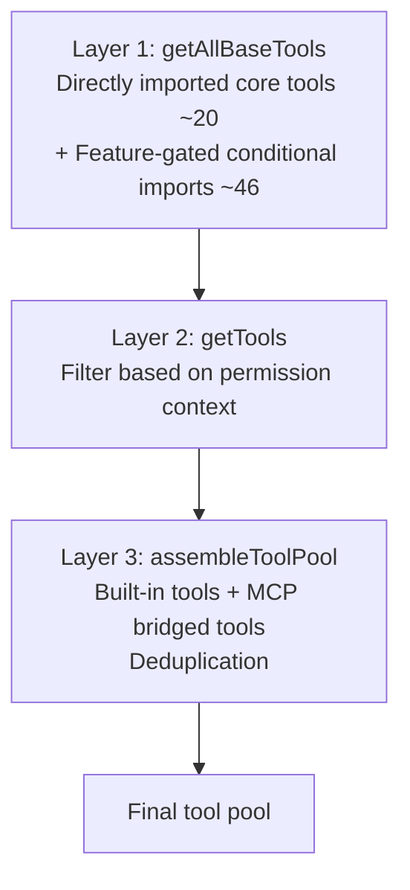
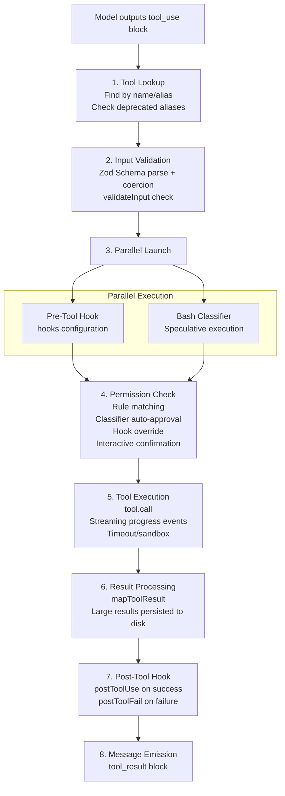
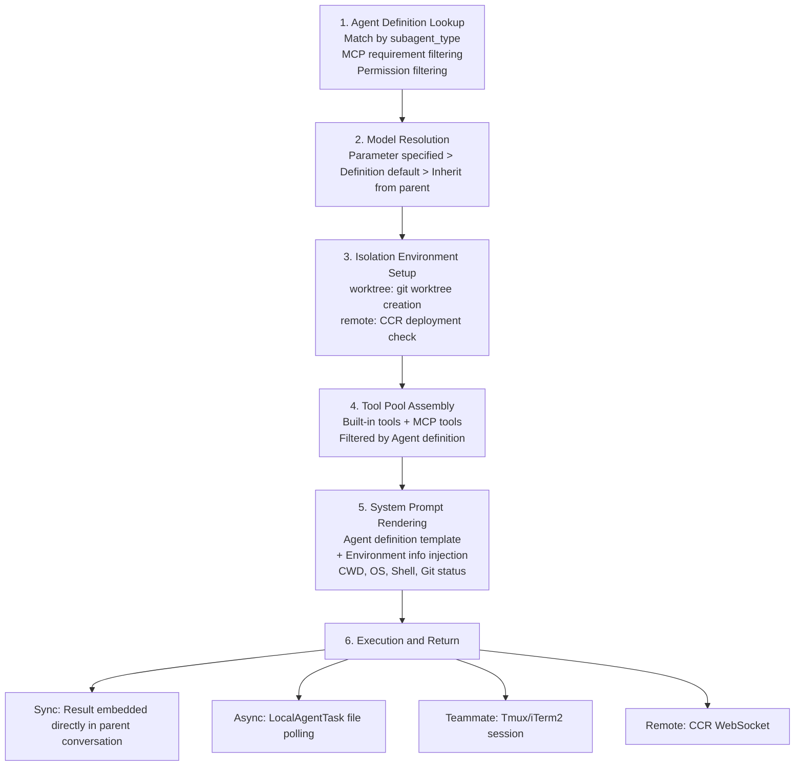
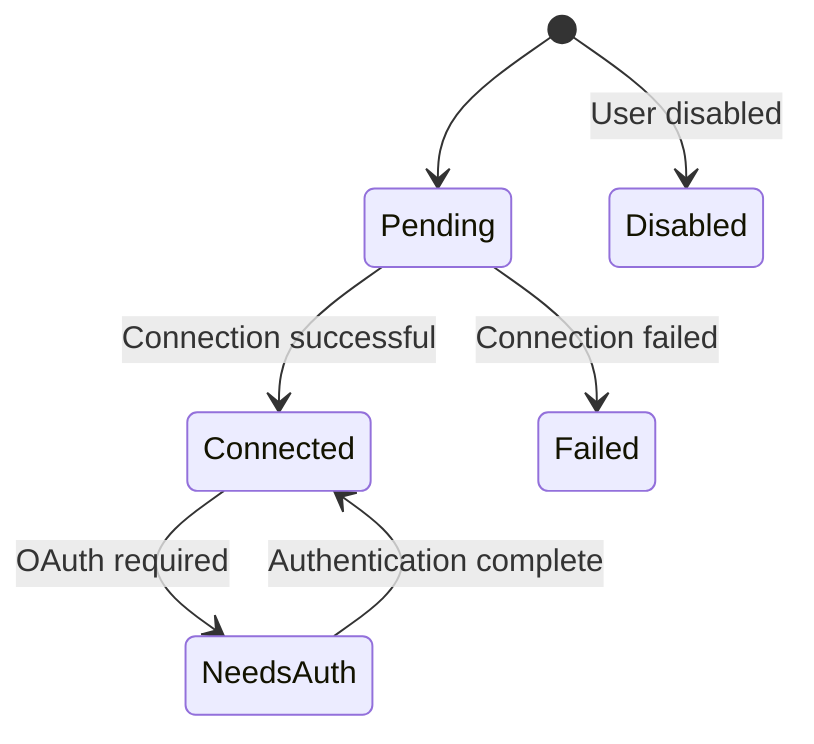

# Chapter 4: Tool System

> The tool system is the carrier of Claude Code's capabilities. 66+ built-in tools + MCP extensions = unlimited possibilities.

All of Claude Code's capabilities—file read/write, Shell commands, code search, sub-Agent spawning, MCP external service calls—are exposed to the model through a unified tool system. The model does not directly operate on the filesystem or network; instead, it accomplishes all side-effecting operations by calling tools. The tool system is the sole bridge connecting "model intelligence" to "the real world."

The core architecture of this system is divided into three layers:

- **Design layer**: The `Tool` generic interface (`src/Tool.ts`)—defines the contract every tool must implement: execution logic, input Schema, safety semantic markers (read-only/destructive/concurrency-safe), permission checks, and UI rendering
- **Assembly layer**: `getAllBaseTools()` → `getTools()` → `assembleToolPool()` (`src/tools.ts`)—from compile-time pruning to runtime filtering, ultimately merging built-in tools and MCP tools into a unified tool pool
- **Execution layer**: `StreamingToolExecutor` (`src/services/tools/`)—executes tools concurrently while the model streams output, handling permission checks, Hook callbacks, and result formatting

This design yields two key advantages: adding a new tool only requires implementing the `Tool` interface, with no changes needed to the execution pipeline or permission system; safety semantics (`isReadOnly`, `isDestructive`) are encoded as interface methods rather than external configuration, ensuring that safety properties always stay in sync with the tool implementation.

**Chapter roadmap**: Sections 4.1–4.2 cover interface definition and the assembly pipeline; 4.3 provides a full inventory of built-in tools; 4.4–4.5 explain the execution lifecycle and concurrency control; 4.6–4.7 dive deep into the two most complex tools (BashTool and AgentTool); 4.8–4.10 cover large result handling, MCP integration, and deferred loading; 4.11–4.12 summarize design insights and UI rendering patterns.

## 4.1 Tool Interface Definition

The starting point of the three-layer architecture described above is the `Tool` interface (`src/Tool.ts`)—the unified contract for all tools (built-in, MCP, REPL). This is one of the most core types in the entire system:

```typescript
export type Tool<Input, Output, P extends ToolProgressData> = {
  // ===== Metadata =====
  name: string                    // Unique tool identifier
  aliases?: string[]              // Aliases (backward compatibility with old names)
  maxResultSizeChars: number      // Maximum result character count
  shouldDefer?: boolean           // Whether to lazy-load (ToolSearch dynamic discovery)

  // ===== Core Execution =====
  call(args, context, canUseTool, parentMessage, onProgress?): Promise<ToolResult<Output>>

  // ===== Prompts & Descriptions =====
  description(input, options): Promise<string>
  prompt(options): Promise<string>

  // ===== Schema Definitions =====
  inputSchema: Input              // Zod input Schema
  inputJSONSchema?: ToolInputJSONSchema  // JSON Schema (API compatible)

  // ===== Security & Permissions =====
  isConcurrencySafe(input): boolean   // Whether it can execute concurrently
  isReadOnly(input): boolean          // Whether it's a read-only operation
  isDestructive?(input): boolean      // Whether it's a destructive operation
  validateInput?(input, context): Promise<ValidationResult>
  checkPermissions(input, context): Promise<PermissionResult>

  // ===== UI Rendering (React Components) =====
  renderToolUseMessage(input, options): React.ReactNode
  renderToolResultMessage?(content, progress, options): React.ReactNode
}
```

Each tool's returned `ToolResult` not only contains data, but can also inject additional messages or modify the context:

```typescript
export type ToolResult<T> = {
  data: T                    // Tool output data
  newMessages?: Message[]    // Additional injected messages
  contextModifier?: (ctx) => ToolUseContext  // Context modifier
}
```

### buildTool Factory Pattern

All tools are created through the `buildTool()` factory function. This function merges `TOOL_DEFAULTS` with the tool's custom definition, ensuring every tool has a complete set of methods:

```typescript
const TOOL_DEFAULTS = {
  isEnabled: () => true,
  isConcurrencySafe: () => false,    // Default assumes unsafe, preventing concurrency issues
  isReadOnly: () => false,           // Default assumes writes, requiring permission checks
  isDestructive: () => false,
  checkPermissions: () => ({ behavior: 'allow', updatedInput }),  // Default allows
  toAutoClassifierInput: () => '',   // Default skips classifier
}

function buildTool<D extends AnyToolDef>(def: D): BuiltTool<D> {
  return {
    ...TOOL_DEFAULTS,
    userFacingName: () => def.name,
    ...def,
  } as BuiltTool<D>
}
```

This is a classic **fail-closed** (default-closed) security design:

- **`isConcurrencySafe: () => false`**: New tools default to non-concurrent execution. Only tools that have been verified as truly safe (such as pure read operations) explicitly opt-in to `true`. This avoids race conditions caused by new tools missing the concurrency safety flag.
- **`isReadOnly: () => false`**: Defaults to assuming the tool has write side effects, so it must go through permission checks. Read-only tools (such as GrepTool, GlobTool) explicitly declare themselves as read-only to skip the permission popup.
- **`toAutoClassifierInput: () => ''`**: Defaults to skipping the ML classifier's auto-approval. This means security-related tools won't be accidentally auto-approved—the tool author must explicitly provide the classifier input format.

This design ensures that: any new tool lacking explicit configuration will take the most conservative path—requiring permissions, disallowing concurrency, and no auto-approval.

### Tool Directory Structure

Each tool is stored independently in its own directory under `src/tools/`, following a unified file organization convention:

```
src/tools/FileEditTool/
├── FileEditTool.ts    // Main implementation: call(), validateInput(), checkPermissions()
├── UI.tsx             // React rendering: renderToolUseMessage, renderToolResultMessage
├── types.ts           // Zod inputSchema + TypeScript types
├── prompt.ts          // Tool-specific system prompt injection content
├── constants.ts       // Constant definitions
└── utils.ts           // Helper functions (e.g., diff generation, quote normalization)
```

The benefits of this separation are:
- **Separation of concerns**: Execution logic (`.ts`) and rendering logic (`UI.tsx`) are fully decoupled—modifying the UI doesn't affect tool behavior
- **Schema reusability**: The Zod Schema defined in `types.ts` is used both for runtime validation and automatically converted to JSON Schema for sending to the API
- **Prompt injection**: Each tool can inject tool-specific usage guidelines into the system prompt via `prompt.ts`, for example FileEditTool injects rules about exact matching

## 4.2 Tool Registration and Assembly

`src/tools.ts` defines a three-layer assembly pipeline from tool definition to availability. This is not a simple "register + use" pattern, but rather a precise pipeline with **compile-time trimming**, **runtime filtering**, and **cache-aware sorting**:



### Layer 1: getAllBaseTools() — Compile-Time Tool Trimming

`getAllBaseTools()` (`src/tools.ts:193-251`) is the **single source of truth** for all tools. It returns all potentially available tools under the current build environment.

Core tools (approximately 20) are directly imported via standard `import` and are always present:

```typescript
import { BashTool } from './tools/BashTool/BashTool.js'
import { FileReadTool } from './tools/FileReadTool/FileReadTool.js'
import { FileEditTool } from './tools/FileEditTool/FileEditTool.js'
// ... other core tools
```

Feature-gated tools (approximately 46) are loaded via conditional `require()`:

```typescript
const SleepTool = feature('PROACTIVE') || feature('KAIROS')
  ? require('./tools/SleepTool/SleepTool.js').SleepTool
  : null

const SnipTool = feature('HISTORY_SNIP')
  ? require('./tools/SnipTool/SnipTool.js').SnipTool
  : null
```

Here, `feature()` is not a runtime function—it is a **Bun bundler compile-time macro**. When building the version for external users, `feature('PROACTIVE')` is evaluated to `false` during the compilation phase, the entire ternary expression is simplified to `const SleepTool = null`, and the `require()` call is physically removed by **Dead Code Elimination**. This means internal tools are not just "hidden"—they don't exist at all in the external build binary, fundamentally eliminating the possibility of bypassing the Feature Gate through runtime means.

There's also an interesting optimization: when `hasEmbeddedSearchTools()` returns `true` (Anthropic's internal build compiles bfs/ugrep into the Bun binary), GlobTool and GrepTool are excluded—because shell aliases already point to faster embedded implementations, making the dedicated tools unnecessary.

### Layer 2: getTools() — Runtime Context Filtering

`getTools()` (`src/tools.ts:271-327`) filters tools at runtime based on the current environment and permission context. It contains four progressive filtering layers:

**1. SIMPLE mode** (`CLAUDE_CODE_SIMPLE` environment variable / `--bare` flag): Reduces the toolset to the minimum core—only BashTool, FileReadTool, and FileEditTool are retained. This is the lightest tool configuration, suitable for resource-constrained or embedded scenarios. When REPL mode is also enabled, these three tools are replaced by REPLTool (because the REPL's VM internally encapsulates them).

**2. REPL mode filtering**: When `isReplModeEnabled()` is true and REPLTool is available, tools in the `REPL_ONLY_TOOLS` set (Bash, FileRead, FileEdit, etc.) are hidden from the direct tool list. These tools still exist within the REPL VM's execution context, but the model cannot call them directly—they must be used indirectly through the REPL tool.

**3. Deny rule filtering**: `filterToolsByDenyRules()` checks whether each tool matches a global deny rule. A deny rule without `ruleContent` (blanket deny) completely removes the corresponding tool, making it invisible to the model in the system prompt. For MCP tools, prefix matching rules like `mcp__server` remove all tools from that server at once—this is done **before** the model sees the tool list, not checked at call time.

**4. `isEnabled()` runtime check**: Each tool's `isEnabled()` method is called, and tools returning `false` are filtered out. This allows tools to decide whether to enable themselves based on runtime conditions (such as whether dependencies are available).

### Layer 3: assembleToolPool() — Merging and Cache-Aware Sorting

`assembleToolPool()` (`src/tools.ts:345-367`) is the final assembly point, merging built-in tools and MCP tools into a unified tool pool:

```typescript
export function assembleToolPool(
  permissionContext: ToolPermissionContext,
  mcpTools: Tools,
): Tools {
  const builtInTools = getTools(permissionContext)
  const allowedMcpTools = filterToolsByDenyRules(mcpTools, permissionContext)

  // Partitioned sorting: built-in tools as a contiguous prefix, MCP tools as a suffix
  const byName = (a: Tool, b: Tool) => a.name.localeCompare(b.name)
  return uniqBy(
    [...builtInTools].sort(byName).concat(allowedMcpTools.sort(byName)),
    'name',
  )
}
```

This code has two key design decisions:

**Partitioned sorting rather than global sorting**: Built-in tools are alphabetically sorted to form a contiguous prefix block, and MCP tools are alphabetically sorted and appended as a suffix block. Why not simply do a single global sort across all tools? Because the API server's caching strategy (`claude_code_system_cache_policy`) sets a cache breakpoint after the last built-in tool. If global sorting were used, an MCP tool named `mcp__github__create_issue` would be inserted between `GlobTool` and `GrepTool`, invalidating all downstream cache keys. Partitioned sorting ensures that adding/removing MCP tools only affects the suffix portion, and the (larger) prefix block of built-in tools always hits the cache.

**`uniqBy('name')` built-in priority**: When a built-in tool and an MCP tool share the same name, `uniqBy` retains the first occurrence (i.e., the built-in tool), because built-in tools come first in the concatenated array. This ensures that built-in tools are not accidentally overridden by MCP tools.

## 4.3 Built-in Tool Inventory

Claude Code includes **66+ built-in tools**, organized into 6 categories by functional domain. These categories reflect the core capability model of a coding agent: **File Operations** are the foundation (read, write, and search are the highest-frequency operations), **Agent Management & Team Collaboration** supports multi-Agent execution, **User Interaction** and **System** ensure human-in-the-loop control, and **Tool Extensions** unify skills, deferred tool loading, and MCP/LSP external capabilities. The guiding principle for tool selection is "cover 95% of a developer's daily workflow"—the remaining 5% is handled by BashTool (the universal fallback), skills, and MCP extensions.

| Category | Tool | Description |
|----------|------|-------------|
| **File Operations** | BashTool | Shell command execution (the most complex tool) |
| | FileReadTool | Read file contents (supports images, PDF, Jupyter) |
| | FileEditTool | Precise string replacement editing (core editing tool) |
| | FileWriteTool | Create/overwrite files |
| | GlobTool | Pattern-based file matching |
| | GrepTool | Regex file content search (based on ripgrep) |
| | NotebookEditTool | Jupyter Notebook editing |
| **Network** | WebFetchTool | Fetch web page content |
| | WebSearchTool | API-driven web search |
| **Agent Management & Team Collaboration** | AgentTool | Spawn sub-Agents (core of multi-Agent architecture) |
| | TaskOutputTool | Output task results |
| | TaskStopTool | Stop background tasks |
| | TaskCreate/Get/Update/ListTool | Task management v2 (see [Chapter 11](15-task-system.md)) |
| | SendMessageTool | Inter-Agent communication |
| | TeamCreateTool | Create Agent teams |
| | TeamDeleteTool | Delete Agent teams |
| | ListPeersTool | List peer Agents |
| **User Interaction** | AskUserQuestionTool | Ask users questions |
| | TodoWriteTool | Manage to-do lists |
| **System** | EnterPlanModeTool | Enter planning mode |
| | ExitPlanModeTool | Exit planning mode |
| | EnterWorktreeTool | Enter Git Worktree isolation |
| | ExitWorktreeTool | Exit Worktree |
| | BriefTool | Generate brief summaries |
| | ConfigTool | Configuration management |
| **Tool Extensions** | SkillTool | Load and execute skills |
| | ToolSearchTool | Search and load deferred tools |
| | ListMcpResourcesTool | List MCP resources |
| | ReadMcpResourceTool | Read MCP resources |
| | MCPTool | MCP tool proxy |
| | LSPTool | Language server operations |

## 4.4 Tool Execution Lifecycle

When the model produces a `tool_use` block during streaming output, the call request is not executed directly—it must pass through a complete processing pipeline. From tool lookup, input validation, permission checking (which may involve user interaction), to actual execution, result formatting, and Hook callbacks, there are 8 stages in total. This pipeline is identical for all tools (built-in, MCP, REPL) and is a direct manifestation of the unified `Tool` interface from Section 4.1. Understanding this pipeline is key to understanding Claude Code's security model and execution semantics.



### Detailed Explanation of Each Stage

**Stage 1 - Tool Lookup**

The system matches tool definitions by `name` and `aliases`. If a tool is called via a deprecated alias, the system appends a deprecation warning in the tool_result, guiding the model to use the new name in subsequent calls. If no matching tool is found, an error message is returned directly—this happens when the model hallucinates a non-existent tool.

**Stage 2 - Input Validation**

Input validation is divided into two phases:

```typescript
// Phase 1: Zod Schema coercion
// Zod's safeParse not only validates, but also performs type coercion (e.g., string number → number)
const parsed = tool.inputSchema.safeParse(rawInput)
// If Schema validation fails, format error message and return to model

// Phase 2: Business logic validation
// Only executed after Schema validation passes
const validation = await tool.validateInput(parsed.data, context)
// Return types:
// { result: true }                              — Validation passed
// { result: false, message, errorCode }         — Direct rejection
// { result: false, message, behavior: 'ask' }   — Show UI prompt to let user decide
```

The two-phase separation design ensures that: the Schema layer handles structural validation (field existence, types), while the business layer handles semantic validation (e.g., FileEditTool checks if the file exists, FileWriteTool checks if the file has been read before writing). The `behavior: 'ask'` mode allows tools to hand the decision to the user in uncertain situations, rather than rejecting outright.

**Stage 3 - Parallel Launch**

The Pre-Tool Hook and Bash classifier **launch simultaneously**, rather than waiting serially. Both operations may take tens to hundreds of milliseconds each, and parallelization can significantly reduce the total latency of permission checks.

- **Pre-Tool Hook**: Executes external scripts configured by the user in `hooks.preToolUse`, which can return `allow`, `deny`, or no decision
- **Bash classifier**: Speculatively classifies BashTool calls for safety (determining if the command is read-only), with results cached for use in permission checks

**Stage 4 - Permission Check**

The permission check is the most complex stage in the entire pipeline, implemented in `checkPermissionsAndCallTool()` (`src/services/tools/toolExecution.ts`). It involves multiple decision sources, evaluated in a chained priority order—once any stage makes a definitive decision, subsequent checks are skipped:

**4a. Hook Permission Override (Highest Priority)**

If the Pre-Tool Hook from Stage 3 returned a permission decision (`hookPermissionResult`), it directly overrides all subsequent checks. The Hook can return three results:
- `allow`: Skip all permission checks and execute directly (e.g., an enterprise internal Hook auto-approves specific commands)
- `deny`: Immediately reject, with a denial reason attached
- No decision: Falls through to the next check layer

**4b. Tool's Own `checkPermissions()`**

Each tool can implement its own permission logic. Most tools use the default implementation (directly returning `allow`), but BashTool's `bashToolHasPermission()` is a complex implementation of 200+ lines (see Section 4.6 for details). File tools check whether the path is within the allowed working directory scope.

**4c. Rule Matching**

The system collects permission rules from **7 sources**, arranged by priority:

| Source | Description | Example |
|--------|-------------|---------|
| `session` | Temporary authorization from the user in the current session | Generated when user clicks "Allow once" |
| `cliArg` | Rules specified via command-line arguments | `--allowedTools 'Bash(git *)'` |
| `localSettings` | `.claude/settings.local.json` | Personal settings not committed to git |
| `userSettings` | `~/.claude/settings.json` | User-level global settings |
| `projectSettings` | `.claude/settings.json` | Project-level shared settings |
| `policySettings` | Organization policy configuration | Mandatory rules distributed by enterprise admins |
| `flagSettings` | Feature flag dynamic configuration | Server-side remote configuration |

Each rule has three behaviors: `allow` (auto-approve), `deny` (auto-reject), `ask` (require interactive confirmation). A rule's `ruleContent` supports three matching modes:
- **Exact match**: `Bash(npm install)` matches only the exact same command
- **Prefix match**: `Bash(git commit:*)` matches all commands starting with `git commit`
- **Wildcard match**: `Bash(git *)` matches all commands starting with `git `

**4d. Speculative Classifier Result (Bash-specific)**

The Bash classifier launched in parallel during Stage 3 returns its result at this point. The classifier is an LLM-side query based on semantic descriptions, used to determine whether a command matches user-defined allow/deny descriptions. If the classifier determines with high confidence that the command is safe (matching an allow description), the permission popup can be automatically skipped. The classifier's result is passed asynchronously via a `pendingClassifierCheck` Promise, and the UI layer can wait for it before displaying the popup.

**4e. Interactive Confirmation Popup**

If none of the above checks made a definitive decision (neither auto-allow nor auto-deny), the user sees a permission confirmation popup. The popup includes:
- Tool name and full input (e.g., Bash command text)
- Destructive command warning (if applicable, from `getDestructiveCommandWarning()`)
- Suggested permission rule (e.g., `Bash(git commit:*)`), which the user can choose to save to avoid future repeated confirmations
- Three action options: **Allow once** (this time only), **Always allow** (save as rule), **Deny**

**4f. Denial Tracking**

`DenialTrackingState` tracks consecutive permission denials. After the same tool or command pattern is denied multiple times, the system injects a guiding prompt into the conversation to help the model understand that it should try a different approach rather than repeatedly requesting the denied operation. This prevents the model from falling into a "request permission → get denied → request again" death loop.

**Stage 5 - Tool Execution**

`tool.call()` performs the actual operation. The key mechanism is the `onProgress` callback—it allows tools to emit progress messages in real time during execution. For example, BashTool streams stdout/stderr output through this callback, allowing users to see command output in real time without waiting for the command to complete. Background tasks (`run_in_background: true`) automatically switch to asynchronous execution after the timeout threshold.

**Stage 6 - Result Processing**

`mapToolResultToToolResultBlockParam()` converts the tool's internal `ToolResult` to the API-compatible `ToolResultBlockParam` format. One core piece of logic is **large result handling**: if the result exceeds `maxResultSizeChars`, the full content is saved to disk, and the model receives a file path + truncation indicator (see Section 4.8 for details). This prevents a single grep search result from blowing up the entire context window.

**Stage 7 - Post-Tool Hook**

The Post-Tool Hook is split into two independent events:

| Hook Event | Trigger | Script Receives |
|------------|---------|-----------------|
| `postToolUse` | Triggered when tool execution succeeds | Tool name, input, and output |
| `postToolFail` | Triggered when tool execution fails | Tool name, input, and error details |

Both are independent Hook events, and users can configure different handling logic for each. For example, you could send a notification in `postToolUse` for BashTool's `git push` command, and log failures in `postToolFail`.

### Error Handling and Propagation

The error handling in the tool execution pipeline follows a core philosophy: **errors are data, not exceptions**. Errors occurring at any stage do not cause process crashes or conversation interruptions—they are converted to `tool_result` messages (with `is_error: true` flag) and returned to the model, allowing the model to self-correct.

Error forms at each stage:

| Stage | Error Type | Handling Method |
|-------|-----------|-----------------|
| Schema validation | Zod parse failure (type errors, missing fields) | `formatZodValidationError()` formats and wraps in `<tool_use_error>` XML tags |
| Business validation | `validateInput()` returns `{result: false}` | Returns validation error message with `errorCode` |
| Permission denial | User clicks "Deny" or rule matches deny | Returns `CANCEL_MESSAGE` or specific denial reason |
| Tool execution | Runtime exceptions (file not found, command failed, etc.) | try-catch captures, `classifyToolError()` classifies then records telemetry |
| MCP tools | `McpToolCallError` or `McpAuthError` | Auth errors trigger OAuth flow, other errors returned to model |

The design of `classifyToolError()` (`src/services/tools/toolExecution.ts`) is noteworthy. In minified builds, JavaScript's `error.constructor.name` gets obfuscated to short identifiers like `"nJT"`, making it unusable for telemetry analysis. Therefore, this function adopts a robust classification priority chain:

1. `TelemetrySafeError` instance → Uses its `telemetryMessage` (messages explicitly marked as telemetry-safe by the developer)
2. Standard Error + errno code → Returns `"Error:ENOENT"`, `"Error:EACCES"`, etc. (stable identifiers for Node.js filesystem errors)
3. Error instance with `.name` length > 3 (not minified) → Uses the original error name
4. Other Errors → Returns `"Error"`
5. Non-Error values → Returns `"UnknownError"`

This design ensures that telemetry data is analyzable under any build mode, while avoiding leaking file paths or code snippets into the telemetry system.

## 4.5 Concurrency Control

Concurrent tool execution follows strict rules:

- **Read-only tools can run in parallel**: Tools with `isReadOnly(input) === true` (such as FileReadTool, GrepTool, GlobTool) can execute simultaneously
- **Write tools run serially**: Tools with `isReadOnly(input) === false` (such as FileEditTool, BashTool write commands) must execute serially
- **Concurrency safety flag**: `isConcurrencySafe(input)` provides more fine-grained control

Tool orchestration is managed by the `runTools()` function in `src/services/tools/toolOrchestration.ts`:

```typescript
// Simplified concurrency logic
const readOnlyTools = toolUses.filter(t => findTool(t).isReadOnly(t.input))
const statefulTools = toolUses.filter(t => !findTool(t).isReadOnly(t.input))

// Read-only tools execute in parallel
await Promise.all(readOnlyTools.map(t => executeTool(t)))

// Stateful tools execute serially
for (const tool of statefulTools) {
  await executeTool(tool)
}
```

### StreamingToolExecutor: Streaming Parallel Execution

The static orchestration strategy above has a limitation: it must wait for the model to **fully output all tool_use blocks** before starting execution. In reality, the model's streaming output takes 5-30 seconds, and a tool_use block may be complete within the first few seconds of streaming—why wait until the end?

`StreamingToolExecutor` (`src/services/tools/StreamingToolExecutor.ts`, approximately 530 lines) is designed precisely for this. While the model is streaming output, as soon as it detects a complete tool_use block, it immediately starts execution:

```typescript
// Tools go through 4 states in StreamingToolExecutor
type ToolStatus = 'queued' | 'executing' | 'completed' | 'yielded'

// Tracking information for each tool
type TrackedTool = {
  id: string
  block: ToolUseBlock
  assistantMessage: AssistantMessage
  isConcurrencySafe: boolean
  results?: Message[]
  pendingProgress: Message[]    // Progress messages emitted immediately, not waiting for final result
}
```

Concurrency control rules are embedded directly within the executor:

```typescript
// Can a tool be executed?
private canExecuteTool(isConcurrencySafe: boolean): boolean {
  const executingTools = this.tools.filter(t => t.status === 'executing')
  return (
    executingTools.length === 0 ||
    (isConcurrencySafe && executingTools.every(t => t.isConcurrencySafe))
  )
}
```

The rule is simple: if no tools are currently executing, any tool can start; if tools are executing, a new tool can only start when **both itself and all currently executing tools are marked as concurrency-safe**. Non-concurrency-safe tools must execute exclusively.

A timeline comparison demonstrates the effect of this optimization:

```
Serial execution (waiting for all tool_use to complete):
[==========API streaming output==========][tool1][tool2][tool3]

Streaming parallel execution (StreamingToolExecutor):
[==========API streaming output==========]
   [tool1]              ← Starts immediately after tool_use_1 completes
      [tool2]           ← Leverages streaming window (5-30s) to cover tool latency
         [tool3]
[======Results ready by the time API output completes======]
```

In typical scenarios, tool execution latency is about 1 second, while model streaming output lasts 5-30 seconds. This means most tool execution can be completely hidden within the streaming window, and the total latency perceived by the user approaches pure API call time.

Another key design is the `progressAvailableResolve` wake-up signal. The result consumer (`getRemainingResults()`) works in an event-driven manner—when new results or progress are ready, the executor wakes the consumer by resolving a Promise, avoiding polling overhead. `pendingProgress` messages (such as BashTool's stdout stream) are emitted to the UI immediately, without waiting for the tool to finish.

### Partitioning Algorithm and Concurrency Limits

Inside StreamingToolExecutor, tools are divided into two execution categories:

1. **Concurrency-safe tools** (`isConcurrencySafe: true`): Can execute simultaneously with other concurrency-safe tools. Typical examples are FileReadTool, GrepTool, GlobTool—they only read data and don't interfere with each other.
2. **Non-concurrency-safe tools**: Must execute exclusively; no other tools can execute simultaneously while they run. FileEditTool and BashTool write operations fall into this category.

The executor's scheduling logic is based on a simple rule: **when no tools are currently executing, any tool can start; when tools are executing, a new tool can only start under the condition that "both itself and all currently executing tools are concurrency-safe"**. Once a non-concurrency-safe tool is encountered, queue processing pauses, waiting for all currently executing tools to complete before the non-concurrency-safe tool runs exclusively.

Even in parallel execution scenarios, there is a hard upper limit on concurrency: `MAX_TOOL_USE_CONCURRENCY = 10` (configurable via the `CLAUDE_CODE_MAX_TOOL_USE_CONCURRENCY` environment variable). This prevents file handle exhaustion or I/O contention when the model issues 20 FileReadTool calls at once.

Additionally, StreamingToolExecutor implements a **sibling cancellation mechanism** (`siblingAbortController`): when a Bash tool execution errors out, it cancels other tools executing in the same batch. This avoids the problem of "the first command fails but subsequent commands continue executing." Errors from non-Bash tools (such as FileReadTool, WebFetchTool) do not cascade—their failures are typically independent and don't affect sibling tools.

The emission order of results is always consistent with the order tools appear in the model's output (FIFO), even if later tools finish first. This ensures determinism and predictability of the message stream.

## 4.6 BashTool Deep Dive

BashTool is the most complex tool in the entire tool system—its implementation is spread across 18 source files (the `src/tools/BashTool/` directory), covering security validation, permission management, sandbox isolation, command semantic parsing, and multiple other subsystems. This complexity stems from a fundamental contradiction: **Shell is the most powerful tool** (it can do almost anything), but it is also **the most dangerous tool** (a single malicious command can delete the entire filesystem).

BashTool's input Schema:

```typescript
{
  command: string              // Shell command
  timeout?: number             // Timeout (milliseconds)
  description?: string         // Activity description (UI display)
  run_in_background?: boolean  // Async execution
  dangerouslyDisableSandbox?: boolean  // Disable sandbox
}
```

### 4.6.1 Security Validation (bashSecurity.ts)

Security validation is BashTool's first line of defense, executed before permission checks. `bashSecurity.ts` is approximately 800 lines of code, implementing **23 named security checks** (mapped to numeric IDs via the `BASH_SECURITY_CHECK_IDS` constant, avoiding recording mutable strings in telemetry logs):

```typescript
const BASH_SECURITY_CHECK_IDS = {
  INCOMPLETE_COMMANDS: 1,        // Incomplete command fragments
  JQ_SYSTEM_FUNCTION: 2,        // jq's system() function calls
  JQ_FILE_ARGUMENTS: 3,         // jq file argument restrictions
  OBFUSCATED_FLAGS: 4,          // Obfuscated command flags
  SHELL_METACHARACTERS: 5,      // Shell metacharacters
  DANGEROUS_VARIABLES: 6,       // Dangerous variables in pipes/redirections
  NEWLINES: 7,                  // Newlines in unquoted content
  DANGEROUS_PATTERNS_COMMAND_SUBSTITUTION: 8,  // Command substitution
  DANGEROUS_PATTERNS_INPUT_REDIRECTION: 9,     // Input redirection
  DANGEROUS_PATTERNS_OUTPUT_REDIRECTION: 10,   // Output redirection
  IFS_INJECTION: 11,            // IFS variable injection
  GIT_COMMIT_SUBSTITUTION: 12,  // Substitution in git commit
  PROC_ENVIRON_ACCESS: 13,      // /proc/self/environ access
  MALFORMED_TOKEN_INJECTION: 14, // Malformed token injection
  BACKSLASH_ESCAPED_WHITESPACE: 15, // Backslash-escaped whitespace
  BRACE_EXPANSION: 16,          // Brace expansion
  CONTROL_CHARACTERS: 17,       // Control characters
  UNICODE_WHITESPACE: 18,       // Unicode whitespace homoglyphs
  MID_WORD_HASH: 19,            // Mid-word # comment attack
  ZSH_DANGEROUS_COMMANDS: 20,   // Zsh dangerous commands
```
  BACKSLASH_ESCAPED_OPERATORS: 21, // Backslash-escaped operators
  COMMENT_QUOTE_DESYNC: 22,     // Comment-quote desync attack
  QUOTED_NEWLINE: 23,           // Newline within quotes
}
```

**Command substitution blocking** is the most critical defense. The `COMMAND_SUBSTITUTION_PATTERNS` array contains 11 patterns, covering all known forms of command substitution:

```typescript
const COMMAND_SUBSTITUTION_PATTERNS = [
  { pattern: /<\(/, message: 'process substitution <()' },
  { pattern: />\(/, message: 'process substitution >()' },
  { pattern: /=\(/, message: 'Zsh process substitution =()' },
  // Zsh EQUALS expansion: =curl evil.com → /usr/bin/curl evil.com
  // Bypasses Bash(curl:*) deny rule because the parser sees the base command as =curl rather than curl
  { pattern: /(?:^|[\s;&|])=[a-zA-Z_]/, message: 'Zsh equals expansion (=cmd)' },
  { pattern: /\$\(/, message: '$() command substitution' },
  { pattern: /\$\{/, message: '${} parameter substitution' },
  { pattern: /\$\[/, message: '$[] legacy arithmetic expansion' },
  { pattern: /~\[/, message: 'Zsh-style parameter expansion' },
  { pattern: /\(e:/, message: 'Zsh-style glob qualifiers' },
  { pattern: /\(\+/, message: 'Zsh glob qualifier with command execution' },
  { pattern: /\}\s*always\s*\{/, message: 'Zsh always block (try/always construct)' },
  { pattern: /<#/, message: 'PowerShell comment syntax' },  // Defense in depth
]
```

Several of these patterns are particularly noteworthy:

- **Zsh equals expansion** (`=curl`): In Zsh, `=cmd` expands to the full path of `cmd` (equivalent to `$(which cmd)`). An attacker can use `=curl evil.com` to bypass the `Bash(curl:*)` deny rule, because the permission system resolves the base command as `=curl` rather than `curl`.
- **Zsh glob qualifiers** (`(e:` and `(+`): Zsh's glob qualifiers can execute arbitrary code during filename matching — this is an often-overlooked code execution vector.
- **PowerShell comment syntax** (`<#`): Although Claude Code does not execute commands in PowerShell, this is included as defense in depth, in case a PowerShell execution path is introduced in the future.

To avoid false positives (e.g., incorrectly detecting command substitution in string literals like `echo '$(...)'`), the security validator uses the `extractQuotedContent()` function to first strip content within quotes. This function iterates character by character, tracking single-quote/double-quote state, and produces three variants: `withDoubleQuotes` (strips only content within single quotes), `fullyUnquoted` (strips all quoted content), and `unquotedKeepQuoteChars` (content stripped but quote characters themselves retained, used for detecting quote adjacency).

**Zsh dangerous commands** also have dedicated defenses. The `ZSH_DANGEROUS_COMMANDS` set contains 18 commands:

- **`zmodload`**: The Zsh module loader, which is an entry point for multiple attacks — `zsh/mapfile` (invisible file I/O via array assignment), `zsh/zpty` (pseudo-terminal command execution), `zsh/net/tcp` (`ztcp` network data exfiltration), `zsh/files` (built-in `rm/mv/ln/chmod` bypassing binary checks)
- **`emulate -c`**: A construct equivalent to `eval` that can execute arbitrary code
- **`sysopen`/`sysread`/`syswrite`/`sysseek`**: Fine-grained file descriptor operations (from the `zsh/system` module)
- **`zf_*` built-in commands** (`zf_rm`, `zf_mv`, `zf_ln`, `zf_chmod`, etc.): Built-in file operations provided by the `zsh/files` module, bypassing permission checks on external binaries

**Tree-sitter AST parsing** provides structured command analysis capabilities. When tree-sitter-bash is available, `parseCommandRaw()` parses the command into an AST, and `parseForSecurityFromAst()` extracts `SimpleCommand[]` (a list of simple commands with quotes resolved) from it. If the AST analysis finds the command structure is too complex (containing command substitutions, expansions, complex control flow), it returns `'too-complex'`, triggering `ask` behavior — that is, requesting user confirmation. When tree-sitter is unavailable (e.g., on certain platforms), the system falls back to a legacy regex-based parsing path. The `checkSemantics()` function performs semantic validation at the AST level, checking for commands that are syntactically valid but semantically dangerous.

### 4.6.2 Multi-layer Permission System (bashPermissions.ts)

`bashToolHasPermission()` (`src/tools/BashTool/bashPermissions.ts`) is the most complex permission function in the entire codebase, implementing the following layered processing:

**Step 1: AST Parsing and Complexity Assessment**

First, it attempts to parse the command using tree-sitter. The parsing result falls into three categories:
- `'simple'`: The command structure is simple and can be checked sub-command by sub-command
- `'too-complex'`: Contains complex structures (nested substitutions, pipe chains, etc.) where safety cannot be guaranteed — skips detailed analysis and goes directly to the `ask` path
- `'parse-unavailable'`: tree-sitter is unavailable, falls back to the legacy `splitCommand_DEPRECATED()` regex splitting

**Step 2: Sub-command Splitting and Upper Bound Protection**

Compound commands (`cmd1 && cmd2 || cmd3`) are split into a sub-command array, with each sub-command checked independently. To prevent CPU exhaustion (maliciously crafted compound commands could cause regex splitting to produce an exponentially growing number of sub-commands), there is a hard upper limit on the split count:

```typescript
export const MAX_SUBCOMMANDS_FOR_SECURITY_CHECK = 50
```

When exceeding 50 sub-commands, the system abandons per-command analysis and directly returns `ask` — this is a safe fallback: anything that cannot be proven safe is left for the user to decide.

**Step 3: Safe Environment Variable Stripping**

Before matching permission rules, safe environment variable assignments preceding the command are stripped. For example, `NODE_ENV=prod` in `NODE_ENV=prod npm run build` is removed, leaving `npm run build` for rule matching. The `SAFE_ENV_VARS` set contains 26 known-safe variables (Go series like `GOEXPERIMENT`/`GOOS`/`GOARCH`, Rust series like `RUST_BACKTRACE`/`RUST_LOG`, Node's `NODE_ENV`, locale variables like `LANG`/`LC_ALL`, etc.).

Why distinguish between safe and unsafe environment variables? Because `MY_VAR=val command` where `MY_VAR` could affect command behavior (e.g., `LD_PRELOAD=evil.so curl`) cannot be unconditionally stripped. However, `NODE_ENV=prod` is harmless, and if not stripped, a user-configured `Bash(npm run:*)` rule would fail to match `NODE_ENV=prod npm run build`.

**Step 4: Prefix Extraction and Rule Suggestions**

`getSimpleCommandPrefix()` extracts a stable 2-word prefix from the command for reusable permission rules. For example:

| Command | Extracted prefix | Suggested rule |
|---------|-----------------|----------------|
| `git commit -m "fix typo"` | `git commit` | `Bash(git commit:*)` |
| `npm run build` | `npm run` | `Bash(npm run:*)` |
| `NODE_ENV=prod npm run build` | `npm run` (after stripping safe env vars) | `Bash(npm run:*)` |
| `ls -la` | `null` (`-la` is a flag, not a subcommand) | Only provides exact match rule |
| `bash -c "rm -rf /"` | `null` (`bash` is blocked from generating prefix rules) | No prefix rule suggested |

Note the last line: bare shell prefixes like `bash`, `sh`, `sudo`, `env` are explicitly blocked from generating prefix rules, because `Bash(bash:*)` is equivalent to `Bash(*)` — this would accidentally allow all commands.

**Step 5: Compound Command Permission Aggregation**

For compound commands, all sub-commands must independently pass permission checks. If any sub-command is denied, the whole command is denied; if any sub-command requires `ask`, the whole command requires `ask`. The number of suggested rules has an upper limit:

```typescript
export const MAX_SUGGESTED_RULES_FOR_COMPOUND = 5
```

When exceeding 5 rules, the permission prompt degrades to a "similar commands" description rather than listing each one. This avoids the confusing experience of a user saving 10+ rules from a single `&&` chain.

### 4.6.3 Sandbox Mode (shouldUseSandbox.ts)

BashTool supports executing commands in a sandbox, restricting file system access, network, and process capabilities. The sandbox decision logic (`shouldUseSandbox()`) returns `false` (no sandbox) under the following conditions:

1. `SandboxManager.isSandboxingEnabled()` returns `false` (globally disabled)
2. The command has `dangerouslyDisableSandbox: true` set and the policy allows bypass
3. The command matches the user-configured `excludedCommands` exclusion list

Platform support: macOS uses `sandbox-exec` profiles, Linux uses bubblewrap (bwrap) to provide landlock-like restrictions. Excluded command processing involves compound command splitting, environment variable stripping, and wildcard matching — sharing the same command parsing infrastructure as the permission system.

### 4.6.4 sed Validation (sedValidation.ts)

The `sed` command has a dedicated validation layer to prevent it from being used as a backdoor to bypass FileEditTool permissions. Validation uses a **whitelist strategy** — only known-safe patterns are automatically approved:

**Safe pattern 1: Pure line printing** (must have `-n` flag)
- `sed -n '5p'` (print line 5)
- `sed -n '1,10p'` (print lines 1-10)
- `sed -n '1p;5p;10p'` (print multiple specified lines)

**Safe pattern 2: Substitution expressions**
- `sed 's/foo/bar/g'` (substitution operation, but flags only allow `g`/`p`/`i`/`I`/`m`/`M`/`1-9`)

**Blocked dangerous operations**:
- `w`/`W` flags (file writing)
- `e`/`E` flags (command execution — `sed` can execute shell commands via the `e` flag!)
- `!` (address negation)
- `{}` blocks (sed script blocks)
- Non-ASCII characters (Unicode homoglyph detection)
- Backslash delimiter `s\` (potential parsing confusion)

When a sed command includes file arguments (e.g., `sed -i 's/foo/bar/' file.txt`), the `-i` (in-place editing) flag must be explicitly present, and file write permission is required. sed in pure read mode is not allowed to operate on file arguments.

### 4.6.5 Path Validation and Destructive Command Warnings

**Path validation** (`pathValidation.ts`) extracts path arguments from commands involving file paths (`cd`, `rm`, `mv`, `cp`, `cat`, `grep`, etc. — approximately 24 command categories) and validates whether they are within the allowed working directory scope. Different commands have different path extraction rules — `cd` concatenates all arguments into one path, `find` collects paths before the first non-glob flag, `grep`/`rg` collect file paths after parsing the pattern argument. All commands respect the POSIX `--` separator (all arguments after it are positional arguments, not flags).

For dangerous deletion paths (`rm -rf /`, `rm -rf ~`), regardless of whatever saved rules the user has, explicit approval is always required — this is a non-overridable security hard limit.

**Destructive command warnings** (`destructiveCommandWarning.ts`) is a purely informational layer — it does not affect permission decisions, only displays additional warnings in the permission prompt. Detected patterns include:

| Category | Pattern | Warning message |
|----------|---------|-----------------|
| Git data loss | `git reset --hard` | "may discard uncommitted changes" |
| Git history overwrite | `git push --force` / `-f` | "may overwrite remote history" |
| Git safety bypass | `--no-verify` | "may skip safety hooks" |
| Git commit overwrite | `git commit --amend` | "may rewrite the last commit" |
| Recursive force delete | `rm -rf` | "may recursively force-remove files" |
| Database | `DROP TABLE` / `TRUNCATE` | "may drop or truncate database objects" |
| Database | `DELETE FROM table;` (no WHERE) | "may delete all rows" |
| Infrastructure | `kubectl delete` | "may delete Kubernetes resources" |
| Infrastructure | `terraform destroy` | "may destroy Terraform infrastructure" |

### 4.6.6 Background Task Management

BashTool supports two background execution modes:

**Explicit backgrounding**: The model sets `run_in_background: true` in the parameters, and the command executes asynchronously as a `LocalShellTask` from the start. Output is streamed to the task output file, and the model can poll for results via `TaskGetTool`.

**Automatic backgrounding**: In assistant mode (long-running conversations), blocking commands are automatically moved to background execution after **15 seconds** (`ASSISTANT_BLOCKING_BUDGET_MS = 15_000`). The system calls `backgroundExistingForegroundTask()` to move the foreground task to the background, freeing the main loop to continue processing. This prevents a long-running `npm install` or `make build` from blocking the entire conversation.

### 4.6.7 Command Semantics (commandSemantics.ts)

BashTool doesn't just mechanically check exit codes — it understands the **semantic conventions** of different commands. In standard Unix convention, exit code 0 = success, non-0 = failure, but this is not universal:

| Command | Exit code 0 | Exit code 1 | Exit code 2+ |
|---------|------------|------------|-------------|
| `grep` | Found match | **No match** (not an error) | Actual error |
| `rg` | Found match | **No match** (not an error) | Actual error |
| `diff` | No differences | **Has differences** (not an error) | Actual error |
| `test` / `[` | Condition true | **Condition false** (not an error) | Syntax error |
| `find` | Success | Partial success (some directories inaccessible) | Actual error |

`interpretCommandResult()` looks up exit codes by command name to interpret them, preventing the model from misinterpreting `grep`'s "no match" as an execution failure and initiating unnecessary retries.

### 4.6.8 Command Classification (UI Display)

BashTool also maintains a command classification system for collapsible display in the UI. The `isSearchOrReadBashCommand()` function analyzes each part of a pipeline, and only marks it as collapsible when **all parts** are search/read commands:

| Category | Commands | UI behavior |
|----------|----------|-------------|
| Search | find, grep, rg, ag, ack, locate, which, whereis | Collapsed as "Searched..." |
| Read | cat, head, tail, less, more, wc, stat, file, jq, awk, cut, sort, uniq, tr | Collapsed as "Read..." |
| List | ls, tree, du | Collapsed as "Listed..." |
| Semantically neutral | echo, printf, true, false, `:` | Skipped (does not affect pipeline classification) |

Semantically neutral commands are skipped in pipeline classification — for example, `ls dir && echo "---" && ls dir2` is still considered a read operation (rather than becoming non-collapsible because of `echo`).

## 4.7 AgentTool Deep Dive

AgentTool is responsible for spawning sub-Agents and is the core of the multi-Agent architecture:

```typescript
{
  description: string          // 3-5 word task description
  prompt: string               // Sub-Agent task instructions
  subagent_type?: string       // Specialized Agent type
  model?: 'sonnet' | 'opus' | 'haiku'
  run_in_background?: boolean  // Async execution
  name?: string                // Addressable teammate name
  isolation?: 'worktree' | 'remote'  // Isolation mode
}
```

### Sub-Agent Lifecycle

A sub-Agent goes through 6 stages from creation to execution, each with precise decision logic:



**Stage 1 - Agent Definition Lookup**: If `subagent_type` is provided, the system matches by type name against predefined Agent definitions (e.g., `coder`, `researcher`). During matching, it also checks whether the MCP services required by the Agent definition are available and whether the current permission mode allows it. When no definition is matched, a generic default configuration is used.

**Stage 2 - Model Resolution**: Model selection follows a three-level priority chain. The `model` field in the call parameters has the highest priority; next is the default model in the Agent definition; finally, it inherits the model currently used by the parent Agent. This design allows cost-sensitive tasks to use `haiku` while complex tasks escalate to `opus`.

**Stage 3 - Isolation Environment Setup**: The `worktree` mode creates an independent working tree via `git worktree add`, allowing the sub-Agent to work in an isolated file system view to avoid file editing conflicts with the parent Agent. The `remote` mode checks CCR (Claude Code Remote) environment availability and prepares for remote deployment.

**Stage 4 - Tool Pool Assembly**: The sub-Agent's tool pool is not necessarily the same as the parent Agent's. Agent definitions can specify tool whitelists/blacklists — for example, the `researcher` type might only receive read-only tools. MCP tools are filtered according to the Agent definition's requirements.

**Stage 5 - System Prompt Rendering**: Merges the prompt template from the Agent definition with environment information. Injected content includes: current working directory, operating system type, shell type, Git repository status, etc. This ensures the sub-Agent has accurate awareness of the execution environment.

**Stage 6 - Execution and Return**: Divided into four modes depending on the invocation method:
- **Synchronous**: The sub-Agent executes directly within the current process, with the result embedded in the parent conversation's tool_result
- **Asynchronous**: Creates a `LocalAgentTask`, the sub-Agent writes results to a temporary file, and the parent Agent polls via `TaskGetTool`
- **Teammate**: Creates a new terminal session via Tmux or iTerm2, with the sub-Agent running as an independent process in parallel, communicable via `SendMessageTool`
- **Remote**: Creates a remote execution environment via CCR, returns a WebSocket URL, with results sent back asynchronously

## 4.8 Large Result Handling Mechanism

When tool output exceeds `maxResultSizeChars`, Claude Code does not inject the entire content into the conversation context:

1. Saves the complete result to the `~/claude-code/tool-results/` directory
2. The model receives: file path preview + truncation indicator
3. The model can read the full content on demand via FileReadTool

This avoids context bloat while maintaining accessibility of the complete data.

### Typical Thresholds for Each Tool

Different tools have `maxResultSizeChars` set according to their output characteristics:

| Tool type | Typical threshold range | Notes |
|-----------|----------------------|-------|
| BashTool | ~100K characters | Shell command output can be very large (e.g., `find /`) |
| GrepTool | ~100K characters | Broad searches may match thousands of lines |
| FileReadTool | ~200K characters | Large files read with on-demand pagination |
| WebFetchTool | ~100K characters | Web page content length is unpredictable |

### Large Result Handling for MCP Tools

MCP tool output has additional processing: binary blobs (such as images, PDFs) exceeding **25KB** are automatically saved to the `.claude/mcp-outputs/` directory. The model receives a file path reference rather than inline base64-encoded data. This is particularly important for handling screenshots, documents, and other binary content returned by MCP servers.

The overall design follows an "on-demand read pattern": the model first sees a summary and location information of the result, and only actively fetches detailed data via FileReadTool when needed. This transforms a one-time context explosion into controlled incremental reading.

> **Design Decision: Three-tier Size Limits for Tool Results**
>
> The source code defines three progressive limit tiers (`src/constants/toolLimits.ts`):
> - **`DEFAULT_MAX_RESULT_SIZE_CHARS = 50,000`**: Default upper limit for a single tool result; exceeding it triggers persistence to disk
> - **`MAX_TOOL_RESULT_TOKENS = 100,000`** (approximately 400KB): Absolute upper limit that no tool can exceed
> - **`MAX_TOOL_RESULTS_PER_MESSAGE_CHARS = 200,000`**: Aggregate upper limit for all tool results in a single message
>
> Why three tiers? Because during concurrent tool execution, 5 tools each returning 50K characters of results means 250K — exceeding the per-message limit. The aggregate upper limit ensures that even when multiple tools return large results concurrently, the total data injected into the conversation won't cause the context window to spiral out of control.

## 4.9 MCP Tool Integration

MCP (Model Context Protocol) tools are seamlessly integrated into Claude Code's tool system through a bridging layer.

### Bridge Tools

| Claude Code tool | MCP function |
|-----------------|-------------|
| MCPTool | Invoke a single MCP tool |
| ListMcpResourcesTool | List MCP resources |
| ReadMcpResourceTool | Read MCP resource content |
| createMcpAuthTool() | OAuth authentication handling |

### 7 Transport Mechanisms

```typescript
type McpTransport =
  | 'stdio'          // Standard input/output (child process MCP server)
  | 'sse'            // Server-Sent Events (HTTP streaming)
  | 'sse-ide'        // SSE variant (IDE extension)
  | 'http'           // HTTP transport (StreamableHTTPClientTransport)
  | 'ws'             // WebSocket (bidirectional real-time)
  | 'sdk'            // SDK native transport (in-process, SdkControlTransport)
  | 'claudeai-proxy' // Claude.ai proxy server
```

### Connection State Machine



Client instances are memoized to avoid repeated initialization. HTTP 404 + JSON-RPC -32001 detects session expiration.

### OAuth Support

MCP integration supports three-stage OAuth:
1. **Standard OAuth 2.0 + PKCE**: Automatic token rotation, 30-second timeout
2. **Cross-Application Access (XAA) via OIDC**: Enterprise IdP integration, single sign-on across multiple MCP servers
3. **Token validation**: Proactively refreshes tokens approaching expiration, macOS Keychain caching

### Configuration and Scoping

```json
{
  "mcpServers": {
    "my-server": {
      "command": "node",
      "args": ["my-mcp-server.js"]
    },
    "remote-server": {
      "url": "https://api.example.com/mcp"
    }
  }
}
```

MCP server configuration supports 7 scopes: local / user / project / dynamic / enterprise / claudeai / managed.

MCP tools are merged with built-in tools during the `assembleToolPool()` stage, undergoing deduplication before unified registration. Large outputs (binary blobs > 25KB) are automatically saved to `.claude/mcp-outputs/`.

> **Design Decision: Why is MCP a Good Fit for the Agent Ecosystem?**
>
> The core design philosophy of MCP is **protocol, not SDK** — any language, any process can implement an MCP server, as long as it follows the JSON-RPC protocol. This forms a natural complement with Claude Code's tool system: built-in tools provide "deep integration" (direct access to in-process state), while MCP tools provide "breadth extension" (connecting external capabilities). The existence of 7 transport mechanisms reflects the diversity of the real world — local tools use stdio (zero network overhead), remote services use HTTP/WebSocket (supporting authentication and reconnection), and IDE plugins use SSE-IDE (adapted to VS Code's process model). The 7-tier configuration scoping (from local to enterprise) ensures that management needs across different organizational scales can all be met.

## 4.10 Tool Search and Lazy Loading

Not all 66+ tools are sent to the model with every API call. `ToolSearchTool` supports **lazy loading**:

- Tools with `shouldDefer: true` do not appear in the initial tool list
- The model can call `ToolSearch` to search for and dynamically load needed tools
- The tool's `searchHint` field provides search hints

This reduces the size of the system prompt and improves prompt cache hit rates.

### The searchHint Field

Each lazily loadable tool can define a `searchHint` string to increase the probability of the tool being discovered. For example, a Jupyter Notebook editing tool might set `searchHint: "notebook jupyter ipynb cell"`. When the model calls `ToolSearch`, the search algorithm matches against tool name, description, and `searchHint` simultaneously.

### ToolSearchTool Query Syntax

ToolSearchTool supports three query modes:

| Syntax | Description | Example |
|--------|-------------|---------|
| `"select:Name1,Name2"` | Exact selection — load specified tools directly by name | `"select:Read,Edit,Grep"` |
| `"keyword1 keyword2"` | Keyword search — returns the top N most matching tools | `"notebook jupyter"` |
| `"+prefix keyword"` | Name prefix constraint — requires tool name to contain the prefix, then sorts by keyword | `"+slack send"` |

The `select:` mode is most commonly used — when the model already knows which tool it needs, it loads directly by name with zero search overhead. The keyword mode is suitable for exploratory scenarios, such as "I need a tool that handles databases."

### Impact on Prompt Caching

The core value of lazy loading is not just reducing prompt size, but more importantly **stabilizing the cache key**. The `tools` array in the API request is part of the cache key — if the tool set sent with each request differs, the cache is invalidated. By lazy-loading infrequently used tools, the initial tool list remains unchanged across most conversation turns, thereby achieving higher prompt cache hit rates, saving token costs, and reducing latency.

## 4.11 Design Insights

**1. The Power of a Unified Interface**

All tools — whether built-in tools that directly access in-process state, MCP tools connected via JSON-RPC, or REPL tools running in separate VMs — share the same `Tool<Input, Output, P>` generic interface. This means the execution pipeline (input validation → permission check → Hook → execution → result processing) is exactly the same for all tools. Adding a new MCP server requires no changes to any execution logic — just implement `call()` and provide `inputSchema`. This uniformity is the key to how Claude Code scales from 20 tools to 66+ tools without increasing system complexity.

**2. Security Semantics Encoded as Types**

`isReadOnly`, `isDestructive`, `isConcurrencySafe` are not just boolean flags — they are **active methods** that participate in runtime decisions. `isReadOnly(input)` takes tool input as a parameter, meaning the same tool can have different security semantics for different inputs. For example, BashTool returns `isReadOnly: true` for `ls` and `false` for `rm`. This fine-grained, input-aware security tagging enables the concurrency scheduler and permission system to make more precise decisions, rather than applying a one-size-fits-all approach to the entire tool.

**3. Rendering as Part of the Tool**

Each tool comes with its own React rendering methods (`renderToolUseMessage`, `renderToolResultMessage`, etc.), rather than having a unified renderer dispatch based on tool type. This "self-describing rendering" design means the tool knows best how its own input and output should be displayed — FileEditTool renders colored diffs, BashTool renders terminal output with exit codes, GrepTool renders search results with line numbers. When adding a new tool, you only need to implement your own `UI.tsx` without modifying any global rendering logic.

**4. Compile-time Trimming via Feature Gates**

Through Bun's `feature()` compile-time macro and dead code elimination, external builds physically exclude the code for internal tools. This is not a runtime `if (isInternal)` check (which could be bypassed), but rather the complete absence of related code from the compiled artifact — even reverse engineering cannot recover it.

**5. Fail-closed Security Defaults**

The choice of `isConcurrencySafe: () => false` and `isReadOnly: () => false` in `TOOL_DEFAULTS` stems from the **asymmetry of failure modes**. If a tool is actually read-only but marked as non-read-only (forgot to opt-in), the consequence is that the user receives unnecessary permission prompts — annoying but safe. Conversely, if a tool with write side effects is incorrectly marked as read-only (forgot to opt-out), the consequence is that it could execute concurrently with other write tools without permission checks, causing data corruption — dangerous and subtle. This asymmetry dictates that defaults must choose the "safe but potentially over-restrictive" direction.

**6. Layered Validation for Defense in Depth**

BashTool's security does not rely on any single line of defense. It has 7+ overlapping security mechanisms: Tree-sitter AST parsing, regex pattern matching, quoted content extraction, path constraint validation, sed whitelist validation, sandbox isolation, and the permission rule system. Each layer has known limitations (regex can be bypassed by carefully crafted input, tree-sitter may be unavailable, sandbox may not be supported by the platform), but the design philosophy is: **any single layer can fail, but an attacker needs to bypass all layers simultaneously to succeed**. This makes exploitation difficulty grow exponentially.

**7. Prompt Cache Stability as an Architectural Constraint**

Multiple seemingly unrelated design decisions are actually driven by the same "invisible" constraint — prompt cache hit rate:
- `assembleToolPool()`'s partitioned sorting (preventing MCP tool changes from polluting built-in tools' cache keys)
- `backfillObservableInput()` only modifying shallow copies at the UI layer rather than API input (preventing message content modifications from invalidating the cache)
- `ToolSearch` lazy loading (stabilizing the initial tool list, avoiding sending different tool sets with each request)

A cache miss means the API needs to reprocess thousands of tokens of system prompt, increasing latency and cost. This economic constraint profoundly shapes the architecture, but it's hard to notice without reading multiple components.

## 4.12 Tool UI Rendering Patterns

Each tool defines not only execution logic but also comes with complete UI rendering capabilities. This is an embodiment of the "rendering as part of the tool" design philosophy — the tool knows best how its own input and output should be displayed.

### Rendering Methods Overview

Each tool can define 4-6 React rendering methods:

| Method | Purpose | Trigger timing |
|--------|---------|---------------|
| `renderToolUseMessage()` | Render tool invocation process | When the model issues tool_use |
| `renderToolResultMessage()` | Render tool execution result | After tool completes execution |
| `renderToolUseRejectedMessage()` | Render permission rejection info | When user rejects permission request |
| `renderToolUseErrorMessage()` | Render error information | When tool execution errors |
| `renderGroupedToolUse()` | Merged rendering of multiple same-type calls | When same-type tools are called consecutively |

### renderGroupedToolUse: Batch Merged Rendering

When the model consecutively calls multiple tools of the same type (e.g., 5 consecutive `FileReadTool` calls), rendering each one individually would take up significant terminal space. The `renderGroupedToolUse()` method merges these calls into a compact view:

```
📖 Read 5 files: src/agent.ts, src/tools.ts, src/cli.ts, ...
```

Rather than:

```
📖 Read src/agent.ts
📖 Read src/tools.ts
📖 Read src/cli.ts
📖 Read src/prompt.ts
📖 Read src/session.ts
```

This not only saves screen space but also makes it easier for users to understand the model's intent — "it's batch-reading files" rather than "it's reading files one by one."

### backfillObservableInput: Input Backfilling

Tool input passes through `backfillObservableInput()` processing before reaching the UI. This method expands input information for UI observers **without modifying the actual input sent to the API**.

A typical example: when the model calls FileEditTool, it only passes a relative path `src/agent.ts`, but the UI display needs the full path `/home/user/project/src/agent.ts`. `backfillObservableInput()` completes the path with CWD for UI use, but the `tool_use` block on the API side remains unchanged.

Why not directly modify the API input? Because of **prompt cache stability**. The message content in API requests is part of the cache key, and any modification would invalidate the cache. `backfillObservableInput()` only affects the UI display layer, leaving API-layer messages untouched.

### Concrete Example: FileEditTool's UI Rendering

FileEditTool's `UI.tsx` renders different visual effects based on the operation type:

- **File creation**: Title displays "Create", renders the full file content with syntax highlighting
- **File editing**: Title displays "Update", renders a structured diff patch, using colors to distinguish added lines (green) and deleted lines (red)
- **Error state**: Displays the context of the match failure, helping the user understand why `old_string` failed to find a match in the file

Each tool's `UI.tsx` follows the same pattern: import the tool's type definitions, implement the corresponding `render*` methods, and return React nodes. This standardized structure provides a clear template for developing new tool UIs.

---

> **Hands-on Practice**: In [claude-code-from-scratch](https://github.com/Windy3f3f3f3f/claude-code-from-scratch)'s `src/tools.ts`, ~325 lines of code implement 7 core tools. Compared to this chapter's 66+ tool system, this is the best starting point for understanding the "minimum viable tool set." See the tutorial [Chapter 2: Tool System](https://github.com/Windy3f3f3f3f/claude-code-from-scratch/blob/main/docs/02-tools.md).
